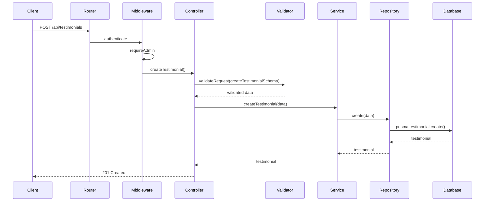

I have created the following plan after thorough exploration and analysis of the codebase. Follow the below plan verbatim. Trust the files and references. Do not re-verify what's written in the plan. Explore only when absolutely necessary. First implement all the proposed file changes and then I'll review all the changes together at the end.

## Observations

The codebase follows a clean layered architecture with clear separation of concerns: controllers handle HTTP requests/responses, services contain business logic, repositories manage database operations, validators use Zod schemas, and types define TypeScript interfaces. The Testimonial model already exists in the Prisma schema with fields for id, name, message, isPublished, order, createdAt, and updatedAt. Authentication is implemented using JWT tokens with `authenticate` and `requireAdmin` middleware following the pattern seen in `file:server/src/routes/project.routes.ts`.

## Approach

Following the established patterns from the project and contact modules, create a complete CRUD API for testimonials with six new files (controller, service, repository, routes, validators, types) and register the routes in `file:server/src/app.ts`. The implementation will mirror the architecture used in existing modules, with protected admin routes for create/update/delete operations and public routes for fetching published testimonials. All operations will include proper validation, error handling, and transformation layers.

## Implementation Steps

### 1. Create Type Definitions (`file:server/src/types/testimonial.types.ts`)

Define TypeScript interfaces and transformation functions:

- **TestimonialRequest** interface with fields: `name`, `message`, `isPublished` (optional), `order` (optional)
- **TestimonialResponse** interface matching Prisma model: `id`, `name`, `message`, `isPublished`, `order`, `createdAt`, `updatedAt`
- **UpdateTestimonialInput** interface with all fields optional except `id`
- **TestimonialFilters** interface with `isPublished` boolean filter
- No transformation functions needed since Prisma model matches response format directly

### 2. Create Repository Layer (`file:server/src/repositories/testimonial.repository.ts`)

Implement database operations using Prisma client:

- **create(data)** - Create new testimonial with `prisma.testimonial.create()`
- **findAll(filters?)** - Retrieve all testimonials with optional `isPublished` filter, ordered by `order` ASC then `createdAt` DESC
- **findById(id)** - Retrieve single testimonial by ID using `prisma.testimonial.findUnique()`
- **update(id, data)** - Update testimonial using `prisma.testimonial.update()`
- **delete(id)** - Delete testimonial using `prisma.testimonial.delete()`
- **updateOrder(id, order)** - Update testimonial order field specifically

Follow the pattern from `file:server/src/repositories/contact.repository.ts` for simple CRUD operations.

### 3. Create Service Layer (`file:server/src/services/testimonial.service.ts`)

Implement business logic with error handling:

- **createTestimonial(data)** - Validate and create testimonial, wrap repository call in try-catch, throw `HttpError` with `HTTP_STATUS.INTERNAL_SERVER_ERROR` on failure
- **getAllTestimonials(filters?)** - Fetch all testimonials with optional filters, handle errors
- **getPublishedTestimonials()** - Convenience method calling `getAllTestimonials({ isPublished: true })`
- **getTestimonialById(id)** - Fetch single testimonial, throw `HTTP_STATUS.NOT_FOUND` if not found
- **updateTestimonial(id, data)** - Update testimonial, handle Prisma error code `P2025` for not found
- **deleteTestimonial(id)** - Delete testimonial, verify existence first, handle `P2025` error
- **updateTestimonialOrder(id, order)** - Update order field specifically

Import `HttpError`, `HTTP_STATUS`, `ERROR_MESSAGES`, and `logger` following the pattern from `file:server/src/services/contact.service.ts`. Add appropriate error messages to `file:server/src/constants/errorMessages.ts` for testimonial operations.

### 4. Create Validators (`file:server/src/validators/testimonial.validators.ts`)

Define Zod schemas for input validation:

- **createTestimonialSchema** - Validate `name` (string, min 2, max 100), `message` (string, min 10, max 2000), `isPublished` (boolean, optional, default false), `order` (number, int, nonnegative, optional, default 0)
- **updateTestimonialSchema** - Validate `id` (string, cuid), all other fields optional
- **testimonialIdSchema** - Validate `id` parameter (string, cuid)
- **testimonialQuerySchema** - Validate query params with `isPublished` (enum ['true', 'false'], optional)
- **updateOrderSchema** - Validate `id` (string, cuid) and `order` (number, int, nonnegative)

Export TypeScript types using `z.infer<typeof schema>` for use in controllers. Follow the pattern from `file:server/src/validators/contact.validators.ts`.

### 5. Create Controller Layer (`file:server/src/controllers/testimonial.controller.ts`)

Implement HTTP request handlers:

- **createTestimonial(req, res)** - POST handler, validate body with `createTestimonialSchema`, call service, return 201 with created testimonial
- **getAllTestimonials(req, res)** - GET handler, parse query params with `testimonialQuerySchema`, call service with filters, return 200 with array
- **getPublishedTestimonials(req, res)** - GET handler for `/published` route, call service method, return 200
- **getTestimonialById(req, res)** - GET handler with `:id` param, validate with `testimonialIdSchema`, call service, return 200
- **updateTestimonial(req, res)** - PUT handler, validate body with `updateTestimonialSchema`, extract id and data, call service, return 200
- **deleteTestimonial(req, res)** - DELETE handler with `:id` param, validate, call service, return 200 with success message
- **updateTestimonialOrder(req, res)** - PATCH handler for `/order` route, validate body, call service, return 200

Use `validateRequest` utility from `file:server/src/utils/validation.ts`. Follow the pattern from `file:server/src/controllers/contact.controller.ts`.

### 6. Create Routes (`file:server/src/routes/testimonial.routes.ts`)

Define Express router with endpoints:

**Public Routes:**
- `GET /api/testimonials` - Get all testimonials (with optional `?isPublished=true` filter)
- `GET /api/testimonials/published` - Get only published testimonials

**Protected Admin Routes (require `authenticate` and `requireAdmin` middleware):**
- `POST /api/testimonials` - Create new testimonial
- `GET /api/testimonials/:id` - Get single testimonial by ID
- `PUT /api/testimonials/:id` - Update testimonial
- `DELETE /api/testimonials/:id` - Delete testimonial
- `PATCH /api/testimonials/:id/order` - Update testimonial order

Import middleware from `file:server/src/middleware/auth.middleware.ts` and `file:server/src/middleware/authorize.middleware.ts`. Follow the pattern from `file:server/src/routes/project.routes.ts`.

### 7. Register Routes in Application (`file:server/src/app.ts`)

Add testimonial routes to Express application:

- Import testimonial routes: `import testimonialRoutes from './routes/testimonial.routes';`
- Register routes after line 35: `app.use('/api/testimonials', testimonialRoutes);`

Follow the existing pattern for route registration in the file.

### 8. Add Error Messages

Update `file:server/src/constants/errorMessages.ts`:

Add to the shared ERROR_KEYS (if not already present) and errorMessagesMap:
- `TESTIMONIAL_NOT_FOUND`: Function returning "Testimonial with id {id} not found"
- `FETCH_TESTIMONIALS_FAILED`: "Failed to fetch testimonials"
- `CREATE_TESTIMONIAL_FAILED`: "Failed to create testimonial"
- `UPDATE_TESTIMONIAL_FAILED`: "Failed to update testimonial"
- `DELETE_TESTIMONIAL_FAILED`: "Failed to delete testimonial"

## API Endpoints Summary

```
Public:
GET    /api/testimonials              - Get all testimonials (optional ?isPublished=true)
GET    /api/testimonials/published    - Get published testimonials

Admin (Protected):
POST   /api/testimonials              - Create testimonial
GET    /api/testimonials/:id          - Get testimonial by ID
PUT    /api/testimonials/:id          - Update testimonial
DELETE /api/testimonials/:id          - Delete testimonial
PATCH  /api/testimonials/:id/order    - Update testimonial order
```

## Architecture Diagram

