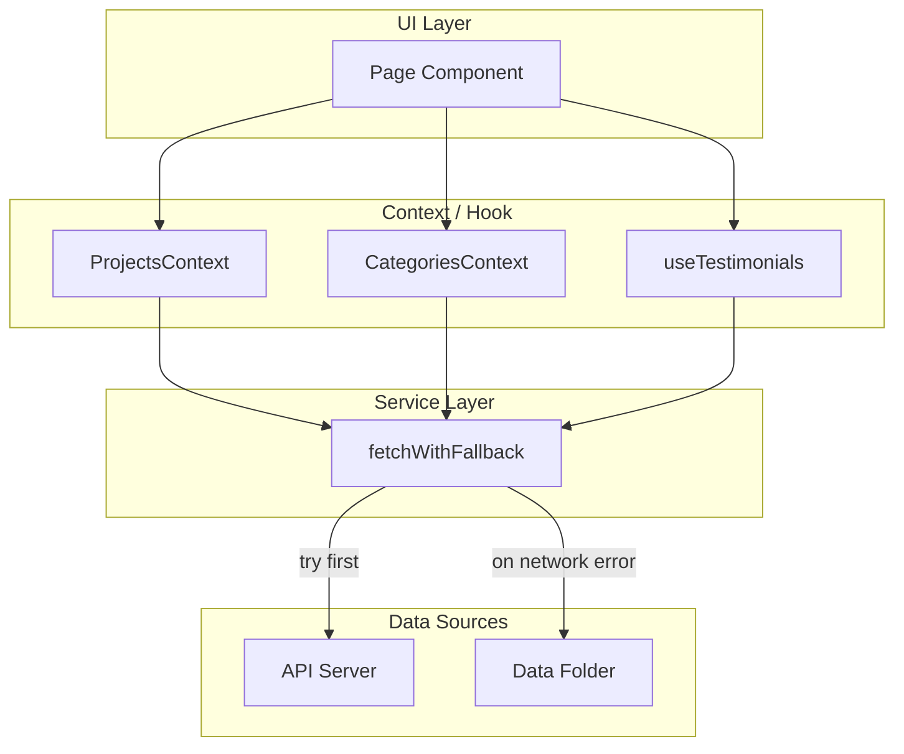
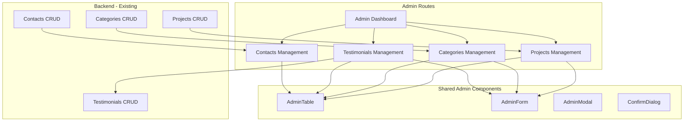

# Loading, Fallback & Admin Panel - Master Plan

## Current State Summary

**API consumers:**

- [ProjectsContext](client/src/contexts/ProjectsContext.tsx) - `fetchProjects()` - has `isLoading`, `error` but Projects page shows nothing while loading
- [CategoriesContext](client/src/contexts/CategoriesContext.tsx) - `fetchCategories()` - silent fail on error
- [Testimonials](client/src/pages/Home/components/Testimonials.tsx) - `fetchPublishedTestimonials()` - silent fail, returns null
- [FavoriteProjects](client/src/components/FavoriteProjects/FavoriteProjects.tsx) - derives from ProjectsContext
- [Project page](client/src/pages/Project/Project.tsx) - uses projects from context; direct navigation to `/projects/:id` may show nothing if project not in list

**Data fallback files:**

- [shiran.projects.ts](client/src/data/shiran.projects.ts) - full project data (matches `ProjectResponse` shape)
- [shiran.categories.ts](client/src/data/shiran.categories.ts) - categories (uses `_id.$oid`, needs mapping to `id`)
- [shiran.testimonials.ts](client/src/data/shiran.testimonials.ts) - testimonials (DONE - mirrors server seed)

**Existing utilities:** [isNetworkError](client/src/utils/errorHandler.ts), [Loader](client/src/components/Loader/Loader.tsx)

---

# Plan 1: Loading, No-Data & Server Fallback

**Goal:** Every API-backed view shows loading, empty-state, and error UI. When server is unreachable, use data files from `client/src/data/`.

## Architecture

## Plan 1 Implementation Steps

### 1.1 Create Reusable UI Components

**Location:** `client/src/components/DataState/`

| Component        | Purpose                                                          |
| ---------------- | ---------------------------------------------------------------- |
| `LoadingState`   | Wraps content area with Loader, optional min-height              |
| `EmptyState`     | Message + optional icon when no data (e.g. "אין פרויקטים להצגה") |
| `ErrorState`     | Error message + optional retry button                            |
| `DataStateGuard` | Composable wrapper for loading/empty/error                       |

Use existing [Loader](client/src/components/Loader/Loader.tsx). Keep RTL and Hebrew copy consistent.

### 1.2 Create `fetchWithFallback` Utility

**Location:** `client/src/utils/fetchWithFallback.ts`

- **Signature:** `fetchWithFallback<T>(apiFn: () => Promise<T>, fallbackData: T): Promise<{ data: T; source: 'api' | 'fallback' }>`
- **Logic:** Call `apiFn()`; on success return `{ data, source: 'api' }`. On `isNetworkError`, return `{ data: fallbackData, source: 'fallback' }`. On other errors, rethrow.
- **Usage:** Services wrap API calls with this when fallback exists.

### 1.3 Normalize Categories Fallback

**Location:** `client/src/data/shiran.categories.ts`

- Add `getCategoriesAsResponse(): CategoryResponse[]` that maps `_id.$oid` to `id` for compatibility with [CategoryResponse](shared/src/types/responses.types.ts).

### 1.4 Update Services with Fallback

**Location:** `client/src/services/`

- **projects.service.ts:** Add `fetchProjectsWithFallback()` using [shiran.projects.ts](client/src/data/shiran.projects.ts). Apply `resolveProjectImages` to fallback.
- **categories.service.ts:** Add `fetchCategoriesWithFallback()` using normalized [shiran.categories.ts](client/src/data/shiran.categories.ts).
- **testimonials.service.ts:** Add `fetchPublishedTestimonialsWithFallback()` using [shiran.testimonials.ts](client/src/data/shiran.testimonials.ts). Map fallback to `{ name, message }[]` for display.

### 1.5 Update Contexts

- **ProjectsContext:** Use `fetchProjectsWithFallback`, set `source: 'api' | 'fallback'` in context. Expose `error` for non-fallback failures.
- **CategoriesContext:** Same pattern; add `error` and `source` to context.
- **Testimonials:** Refactor to `useTestimonials` hook with loading/error/empty handling.

### 1.6 Update Pages

- **Projects:** Use `LoadingState` when `isLoading`, `EmptyState` when `!isLoading && projects.length === 0`, `ErrorState` when `error`. Optional banner when `source === 'fallback'`.
- **Project:** Handle direct navigation: if project not in `projects`, call `fetchProject(id)` with fallback from `shiran.projects.ts` by id. Show loading/error/404 states.
- **Testimonials:** Show loading skeleton or hide until loaded; show empty state if no testimonials.

### 1.7 Git Strategy (Plan 1)

- Branch: `feat/loading-fallback`
- Commits: (1) DataState components, (2) fetchWithFallback + testimonials data, (3) services + contexts, (4) page updates

---

# Plan 2: Admin Panel

**Goal:** Full admin UI for Projects, Categories, Testimonials, and Contacts. Modular, reusable components.

## Plan 2 Architecture

## Plan 2 Implementation Steps

### 2.1 Admin Services

**Location:** `client/src/services/admin/`

- `adminProjects.service.ts` - CRUD using existing [urls](client/src/constants/urls.ts)
- `adminCategories.service.ts`
- `adminTestimonials.service.ts`
- `adminContacts.service.ts` - GET list, GET by id, PATCH read, DELETE

### 2.2 Shared Admin Components

**Location:** `client/src/components/Admin/`

| Component         | Purpose                                              |
| ----------------- | ---------------------------------------------------- |
| `AdminTable`      | Generic table with columns config, sort, actions     |
| `AdminForm`       | Form wrapper with submit/cancel, validation feedback |
| `AdminModal`      | Modal for create/edit                                |
| `ConfirmDialog`   | Delete confirmation                                  |
| `AdminPageLayout` | Title + actions bar + content area                   |

### 2.3 Admin Pages (Replace Placeholders)

**Location:** `client/src/pages/Admin/`

- **Dashboard (index):** Overview cards (counts: projects, categories, unread contacts, testimonials). Links to each section.
- **ProjectsPage:** List with filters, create/edit modal, delete with confirm. Image upload integration.
- **CategoriesPage:** List, create/edit modal (title, urlCode), delete.
- **TestimonialsPage:** List with publish toggle, order control, create/edit modal.
- **ContactsPage:** List with isRead filter, mark as read, view detail, delete.

### 2.4 Routing

- Update [App.tsx](client/src/App.tsx) admin children to use new page components instead of placeholders.
- Lazy-load admin pages for code splitting.

### 2.5 Git Strategy (Plan 2)

- Branch: `feat/admin-panel` (from `main` after Plan 1 merged)
- Commits: (1) admin services, (2) shared admin components, (3) dashboard + projects page, (4) categories + testimonials pages, (5) contacts page + polish

---

## Execution Order

1. **Plan 1** - Complete loading/fallback work, merge to `main`
2. **Plan 2** - Implement admin panel on top of stable base

## Best Practices Applied

- **Modularity:** Reusable DataState and Admin components
- **Single responsibility:** Services for API, contexts for state, components for UI
- **Error handling:** Centralized `isNetworkError`, user-facing messages
- **RTL/Hebrew:** All copy in Hebrew, dir="rtl" where needed
- **Git:** Feature branches, small logical commits
