I have created the following plan after thorough exploration and analysis of the codebase. Follow the below plan verbatim. Trust the files and references. Do not re-verify what's written in the plan. Explore only when absolutely necessary. First implement all the proposed file changes and then I'll review all the changes together at the end.

## Observations

The codebase has a well-structured authentication system with `AuthContext` providing user state, login/logout functions, and loading states. Currently, login/register pages exist outside the main `Layout`, rendering without navbar/footer. The `Navbar` component displays only navigation links from `appRoutes` without any authentication UI. The app uses Hebrew (RTL) throughout with consistent styling patterns (Tailwind CSS with custom primary/secondary colors). A `ProtectedRoute` component exists for route protection.

## Approach

The implementation will integrate authentication UI into the existing navbar by adding conditional rendering based on authentication state. Login/register routes will be moved inside the `Layout` to provide consistent navigation. A user menu dropdown will be created for authenticated users showing their name and logout option. The approach maintains existing RTL support, styling patterns, and smooth transitions while ensuring seamless user experience during authentication state changes.

## Implementation Steps

### 1. Update Navbar Component with Authentication UI

Modify file:client/src/components/Navbar/Navbar.tsx to integrate authentication:

**Import authentication hook:**
- Add `useAuth` import from `../../hooks/useAuth`
- Destructure `isAuthenticated`, `user`, `logout`, and `isLoading` from the hook

**Add state for user menu:**
- Create state `const [showUserMenu, setShowUserMenu] = useState(false)` for dropdown visibility
- Create ref `userMenuRef` to handle click-outside behavior for the dropdown

**Add click-outside handler for user menu:**
- Similar to existing mobile menu handler, add effect to close user menu when clicking outside
- Attach event listener when `showUserMenu` is true

**Conditional rendering in navigation list:**
- After the existing navigation items (inside the `<ul>` element), add conditional rendering
- When `!isAuthenticated && !isLoading`: Display login and register buttons
  - Login button: Link to `/login` with text "התחברות", styled with `bg-primary text-white` for desktop, `text-primary` for mobile
  - Register button: Link to `/register` with text "הרשמה", styled with `bg-secondary text-black`
- When `isAuthenticated && user`: Display user menu
  - Create a relative container `
`
  - Add button showing user name with dropdown icon: `{user.name} ▼`
  - Style button with `bg-secondary text-black` and cursor pointer
  - On click, toggle `showUserMenu` state
  - When `showUserMenu` is true, render dropdown menu:
    - Absolute positioned div with `bg-white shadow-lg rounded-xl` 
    - Position: `absolute left-0 top-full mt-2` (adjust for RTL: `right-0`)
    - Add user info section showing name and email with smaller text
    - Add logout button that calls `logout()` function with loading state
    - Style logout button with `text-red-600 hover:bg-red-50`

**Handle logout with loading state:**
- Create async handler `handleLogout` that sets loading state, calls `logout()`, and navigates to home
- Show "מתנתק..." text during logout
- Add smooth transition with opacity change

**RTL considerations:**
- Ensure dropdown menu uses `right-0` instead of `left-0` for RTL alignment
- Verify text alignment is correct for Hebrew

### 2. Move Login/Register Routes Inside Layout

Modify file:client/src/App.tsx to restructure routing:

**Update appRoutes array:**
- Add login route object: `{ path: 'login', title: 'התחברות', element: <Login />, notNavigateable: true }`
- Add register route object: `{ path: 'register', title: 'הרשמה', element: <Register />, notNavigateable: true }`

**Update router configuration:**
- Remove the separate login/register route definitions (lines 74-81)
- The routes will now be automatically included in the Layout's children through the existing `appRoutes.map()` logic

**Result:**
- Login and register pages will now render within the Layout component
- They will have navbar and footer like other pages
- Navigation will be consistent across all pages

### 3. Update Login and Register Pages

Modify file:client/src/pages/Auth/Login.tsx and file:client/src/pages/Auth/Register.tsx:

**Remove full-page layout wrapper:**
- Remove the outer `
` wrapper
- Keep only the inner content `
`
- Wrap content in `
` to center the form

**Update navigation links:**
- Change `<a href="/register">` to `<Link to="/register">` (import Link from react-router-dom)
- Change `<a href="/login">` to `<Link to="/login">`
- This ensures client-side navigation without page reload

**Add redirect for authenticated users:**
- At the top of component, check `isAuthenticated` from `useAuth()`
- If already authenticated, use `<Navigate to="/" replace />` to redirect to home
- This prevents authenticated users from accessing login/register pages

### 4. Add Loading State During Authentication Check

Modify file:client/src/App.tsx to show loading indicator:

**Create loading component:**
- In the `AppRoutes` component, check `isLoading` from `useAuth()` hook
- If loading, return centered loading indicator: `

טוען...

`
- Use the existing `Loader` component from file:client/src/components/Loader/Loader.tsx for consistency

**Prevent flash of unauthenticated content:**
- This ensures the app doesn't briefly show login buttons before authentication state is determined
- Provides smooth user experience on page refresh

### 5. Enhance User Menu with Smooth Transitions

Add CSS transitions to the user menu dropdown in file:client/src/components/Navbar/Navbar.tsx:

**Dropdown animation:**
- Add transition classes: `transition-all duration-200 ease-in-out`
- Use opacity and transform for smooth appearance: `opacity-0 scale-95` when hidden, `opacity-100 scale-100` when visible
- Consider using conditional classes based on `showUserMenu` state

**Logout button loading state:**
- Disable button during logout with `disabled` attribute
- Show loading text "מתנתק..." instead of "התנתק"
- Add opacity change: `disabled:opacity-50`

### 6. Ensure RTL Text Alignment

Verify RTL support across all authentication UI:

**Navbar user menu:**
- Add `dir="rtl"` to dropdown menu container
- Ensure text alignment is right-aligned: `text-right`
- Verify icons and arrows are positioned correctly for RTL

**Login/Register pages:**
- Already have `dir="rtl"` on main container
- Verify it's maintained after removing full-page wrapper
- Add to parent container if needed

## Visual Structure

```mermaid
sequenceDiagram
    participant User
    participant Navbar
    participant AuthContext
    participant LoginPage
    participant App

    User->>App: Loads application
    App->>AuthContext: Check authentication
    AuthContext-->>App: isLoading = true
    App-->>User: Show loading indicator
    AuthContext->>AuthContext: checkAuth()
    AuthContext-->>App: isLoading = false, isAuthenticated
    
    alt Not Authenticated
        App-->>Navbar: Render login/register buttons
        User->>Navbar: Click login button
        Navbar->>LoginPage: Navigate to /login
        User->>LoginPage: Enter credentials
        LoginPage->>AuthContext: login(email, password)
        AuthContext-->>LoginPage: Success
        LoginPage->>App: Navigate to home
        App-->>Navbar: Render user menu
    else Authenticated
        App-->>Navbar: Render user menu with user.name
        User->>Navbar: Click user menu
        Navbar-->>User: Show dropdown (name, email, logout)
        User->>Navbar: Click logout
        Navbar->>AuthContext: logout()
        AuthContext-->>Navbar: Success
        Navbar->>App: Navigate to home
        App-->>Navbar: Render login/register buttons
    end
```

## Key Files to Modify

| File | Changes |
|------|---------|
| file:client/src/components/Navbar/Navbar.tsx | Add authentication UI, user menu dropdown, logout handler |
| file:client/src/App.tsx | Move login/register routes inside Layout, add loading state |
| file:client/src/pages/Auth/Login.tsx | Remove full-page wrapper, update links, add redirect for authenticated users |
| file:client/src/pages/Auth/Register.tsx | Remove full-page wrapper, update links, add redirect for authenticated users |