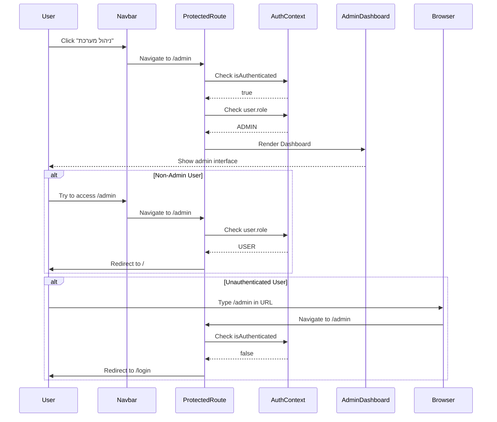

I have created the following plan after thorough exploration and analysis of the codebase. Follow the below plan verbatim. Trust the files and references. Do not re-verify what's written in the plan. Explore only when absolutely necessary. First implement all the proposed file changes and then I'll review all the changes together at the end.

## Observations

The authentication system is fully implemented with `AuthContext`, `ProtectedRoute` component supporting `requireAdmin` prop, and user role management (`ADMIN`/`USER`). The backend has admin-protected endpoints for project CRUD operations (create, update, delete, image management) and category management. Admin dashboard and project management interfaces have been planned but not yet implemented. The current App.tsx has public routes under the main Layout, with login/register now integrated inside the Layout (as per phase 1 implementation).

## Approach

Configure route protection by adding admin routes to App.tsx wrapped with `ProtectedRoute` component using `requireAdmin={true}`. Create placeholder admin pages following the planned structure from existing documentation. Add admin dashboard access link in the navbar for authenticated admin users. Ensure proper redirect behavior: unauthenticated users → login page, non-admin users → home page. Follow the existing lazy loading pattern and maintain RTL support throughout.

## Implementation Steps

### 1. Create Admin Dashboard Structure

**File**: `file:client/src/pages/Admin/Dashboard.tsx`

Create the main admin dashboard container page:
- Import `Outlet` from `react-router-dom` to render nested admin routes
- Import `Suspense` and `Loader` component from `file:client/src/components/Loader`
- Import `Helmet` from `react-helmet-async` for page title
- Create main container with `dir="rtl"` attribute
- Add page title "ניהול מערכת" (System Management)
- Wrap `Outlet` with `Suspense` fallback using `Loader` component
- Add basic styling: `min-h-screen bg-gray-50 px-page-all py-section-all`

**File**: `file:client/src/pages/Admin/AdminHome.tsx`

Create admin dashboard home/overview page:
- Display welcome message with user name from `useAuth()` hook
- Show quick stats cards (placeholder for now):
  - Total projects count
  - Total categories count
  - Recent contact submissions count
- Add quick action buttons linking to main admin sections:
  - "ניהול פרויקטים" → `/admin/projects`
  - "ניהול קטגוריות" → `/admin/categories`
  - "הודעות צור קשר" → `/admin/contacts`
- Use card-based layout: `bg-white rounded-xl shadow-md p-6`
- Add RTL support with `dir="rtl"`

**File**: `file:client/src/pages/Admin/Projects/ProjectsPlaceholder.tsx`

Create placeholder for projects management:
- Display heading "ניהול פרויקטים"
- Show message: "ממשק ניהול הפרויקטים יושלם בשלב הבא"
- Add note referencing the planned implementation from `file:.cursor/plan-v2-implement-projects-management-interface.md`
- Include basic layout structure matching planned design

**File**: `file:client/src/pages/Admin/Categories/CategoriesPlaceholder.tsx`

Create placeholder for categories management:
- Display heading "ניהול קטגוריות"
- Show message: "ממשק ניהול הקטגוריות יושלם בשלב הבא"
- Basic CRUD interface structure (table view placeholder)

**File**: `file:client/src/pages/Admin/Contacts/ContactsPlaceholder.tsx`

Create placeholder for contact submissions:
- Display heading "הודעות צור קשר"
- Show message: "ממשק צפייה בהודעות יושלם בשלב הבא"
- Table structure placeholder for contact submissions list

### 2. Update App.tsx with Protected Admin Routes

**File**: `file:client/src/App.tsx`

Add admin routes with protection:

**Import admin components with lazy loading:**
```typescript
const Dashboard = lazy(() => import('./pages/Admin/Dashboard'));
const AdminHome = lazy(() => import('./pages/Admin/AdminHome'));
const ProjectsPlaceholder = lazy(() => import('./pages/Admin/Projects/ProjectsPlaceholder'));
const CategoriesPlaceholder = lazy(() => import('./pages/Admin/Categories/CategoriesPlaceholder'));
const ContactsPlaceholder = lazy(() => import('./pages/Admin/Contacts/ContactsPlaceholder'));
```

**Import ProtectedRoute:**
- Add import: `import { ProtectedRoute } from './components/Auth/ProtectedRoute'`

**Add admin route configuration in `createBrowserRouter` array:**
- Add new route object at the same level as the main Layout route
- Structure:
```typescript
{
  path: '/admin',
  element: (
    <ProtectedRoute requireAdmin={true}>
      <Dashboard />
    </ProtectedRoute>
  ),
  children: [
    {
      path: '',
      element: <AdminHome />
    },
    {
      path: 'projects',
      element: <ProjectsPlaceholder />
    },
    {
      path: 'categories',
      element: <CategoriesPlaceholder />
    },
    {
      path: 'contacts',
      element: <ContactsPlaceholder />
    }
  ]
}
```

**Route protection behavior:**
- All `/admin/*` routes require authentication AND admin role
- Unauthenticated users → redirected to `/login` (handled by ProtectedRoute)
- Authenticated non-admin users → redirected to `/` (handled by ProtectedRoute)
- Admin users → access granted

### 3. Add Admin Dashboard Link to Navbar

**File**: `file:client/src/components/Navbar/Navbar.tsx`

Enhance navbar with admin access:

**Add admin link for admin users:**
- After the existing navigation items in the `<ul>` element
- Before the authentication UI section
- Add conditional rendering: `{isAuthenticated && user?.role === 'ADMIN' && ...}`
- Render admin link:
  - Use `NavLink` component to `/admin`
  - Text: "ניהול מערכת" (System Management)
  - Icon: `<i className="fa-solid fa-gear"></i>` (settings/gear icon)
  - Active styling: `font-bold text-yellow-400`
  - Inactive styling: `font-semibold opacity-90`
  - Mobile: Same styling as other nav items
  - Desktop: Distinct color to indicate admin section (e.g., `text-yellow-300`)

**Styling considerations:**
- Make admin link visually distinct from regular navigation
- Use icon + text combination
- Ensure RTL alignment is correct
- Add hover effect: `hover:text-yellow-200`

### 4. Verify ProtectedRoute Redirect Behavior

**File**: `file:client/src/components/Auth/ProtectedRoute.tsx`

Review and confirm existing implementation:

**Current behavior (already implemented):**
- Shows loading state while checking authentication
- Redirects to `/login` if not authenticated
- Redirects to `/` if authenticated but not admin (when `requireAdmin={true}`)
- Renders children if all conditions met

**No changes needed** - the component already handles all required scenarios correctly.

### 5. Add Role-Based UI Elements in Components

**Identify components that need role checks:**

**File**: `file:client/src/pages/Projects/Projects.tsx` (if edit/delete buttons exist)
- Add conditional rendering for edit/delete buttons
- Check: `const { user } = useAuth()` and `user?.role === 'ADMIN'`
- Show admin actions only for admin users

**File**: `file:client/src/pages/Project/Project.tsx` (project details page)
- Add "Edit Project" button for admin users
- Link to `/admin/projects/:id/edit` (for future implementation)
- Conditional: `{user?.role === 'ADMIN' && <Link to={...}>ערוך פרויקט</Link>}`

**Pattern for role checks:**
```typescript
const { user, isAuthenticated } = useAuth();
const isAdmin = isAuthenticated && user?.role === 'ADMIN';

// Then use in JSX:
{isAdmin && <AdminOnlyComponent />}
```

### 6. Create Admin Navigation Component (Optional Enhancement)

**File**: `file:client/src/components/Admin/AdminNav.tsx`

Create reusable admin navigation for admin pages:
- Horizontal tab-style navigation or sidebar
- Links to main admin sections
- Active state highlighting
- Use `NavLink` with `isActive` prop
- Styling: `bg-white shadow-md rounded-xl p-4`
- Include in `Dashboard.tsx` above the `Outlet`

**Navigation items:**
- Dashboard Overview → `/admin`
- Projects → `/admin/projects`
- Categories → `/admin/categories`
- Contacts → `/admin/contacts`

### 7. Add Breadcrumb Navigation for Admin Pages

**File**: `file:client/src/components/Admin/Breadcrumbs.tsx`

Create breadcrumb component for admin section:
- Accept `items` prop: array of `{ label: string, path?: string }`
- Render breadcrumb trail with separators
- Use `Link` for clickable items, plain text for current page
- Separator: `<i className="fa-solid fa-chevron-left"></i>` (reversed for RTL)
- Styling: `text-sm text-gray-600`
- Example: "ניהול מערכת > פרויקטים > פרויקט חדש"

**Usage in admin pages:**
```typescript
<Breadcrumbs items={[
  { label: 'ניהול מערכת', path: '/admin' },
  { label: 'פרויקטים', path: '/admin/projects' },
  { label: 'פרויקט חדש' }
]} />
```

### 8. Handle Unauthorized Access Gracefully

**Error handling for admin routes:**

**File**: `file:client/src/pages/Admin/Unauthorized.tsx`

Create unauthorized access page:
- Display message: "אין לך הרשאה לגשת לדף זה"
- Show user role and required role
- Provide link back to home page
- Use error styling: `text-red-600`

**Update ProtectedRoute to use Unauthorized page:**
- Instead of redirecting to `/`, show Unauthorized component
- Or keep redirect behavior but add toast notification
- Consider user experience: redirect is cleaner for non-admin users

### 9. Testing Checklist

**Manual testing scenarios:**

1. **Unauthenticated user access:**
   - Try accessing `/admin` → should redirect to `/login`
   - Try accessing `/admin/projects` → should redirect to `/login`
   - After login as regular user → should redirect to `/`

2. **Regular user (non-admin) access:**
   - Login as USER role
   - Try accessing `/admin` → should redirect to `/`
   - Navbar should NOT show "ניהול מערכת" link
   - Project pages should NOT show edit/delete buttons

3. **Admin user access:**
   - Login as ADMIN role
   - Access `/admin` → should show admin dashboard
   - Navbar should show "ניהול מערכת" link
   - All admin routes should be accessible
   - Project pages should show edit/delete buttons

4. **Navigation flow:**
   - Click admin link in navbar → navigates to `/admin`
   - Click admin section links → navigates correctly
   - Logout from admin section → redirects to home
   - Browser back button → respects protection

### 10. Future-Proofing for Upcoming Phases

**Prepare for project management implementation:**

**File structure ready for expansion:**
- `file:client/src/pages/Admin/Projects/ProjectsList.tsx` (planned)
- `file:client/src/pages/Admin/Projects/ProjectForm.tsx` (planned)
- `file:client/src/pages/Admin/Projects/ProjectDetails.tsx` (planned)

**Update routes when implementing:**
- Replace `ProjectsPlaceholder` with actual components
- Add nested routes for create/edit/view:
  - `/admin/projects` → ProjectsList
  - `/admin/projects/new` → ProjectForm
  - `/admin/projects/:id` → ProjectDetails
  - `/admin/projects/:id/edit` → ProjectForm with id

**Hooks and utilities ready:**
- `file:client/src/hooks/useProjects.ts` (planned for API calls)
- `file:client/src/hooks/useCategories.ts` (planned for categories)

## Route Protection Summary

```mermaid
graph TD
    A[User Accesses /admin] --> B{Authenticated?}
    B -->|No| C[Redirect to /login]
    B -->|Yes| D{Admin Role?}
    D -->|No| E[Redirect to /]
    D -->|Yes| F[Show Admin Dashboard]
    
    C --> G[Login Page]
    G --> H[After Login]
    H --> B
    
    E --> I[Home Page]
    
    F --> J[Admin Routes Accessible]
    J --> K[/admin - Dashboard]
    J --> L[/admin/projects]
    J --> M[/admin/categories]
    J --> N[/admin/contacts]
```

## Admin Access Flow

