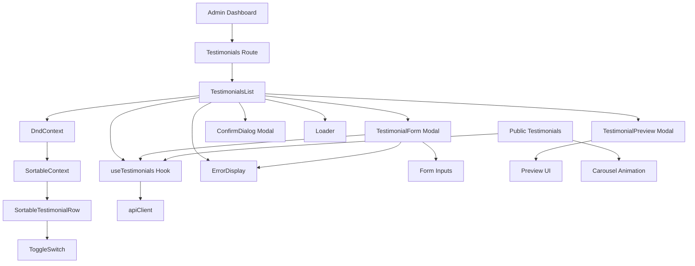
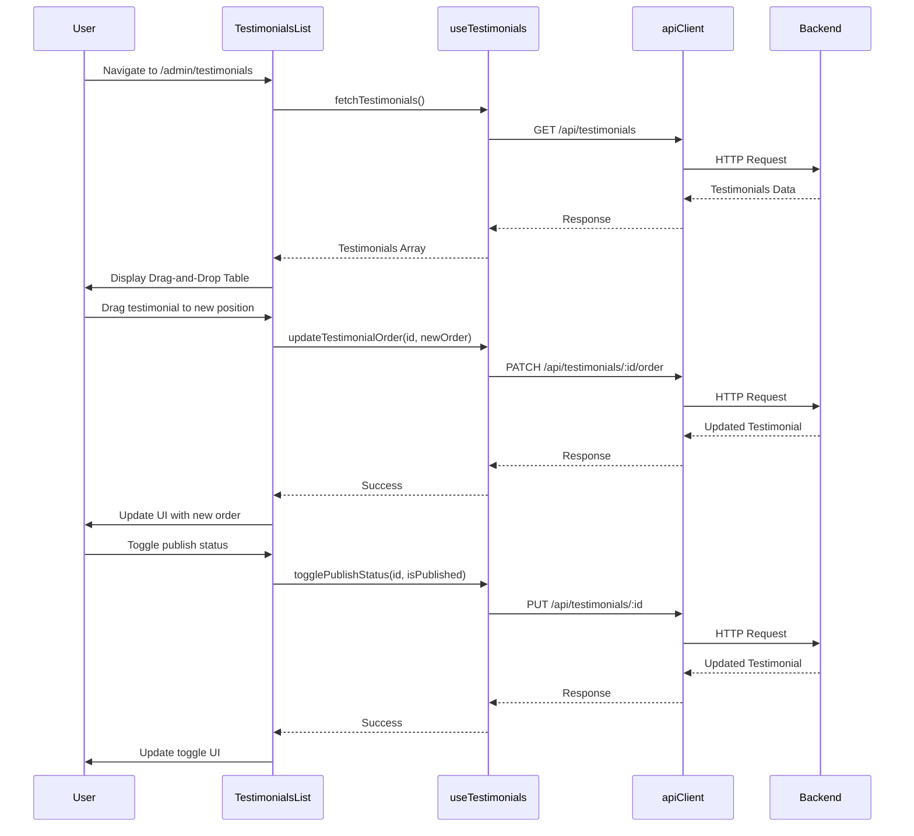

I have created the following plan after thorough exploration and analysis of the codebase. Follow the below plan verbatim. Trust the files and references. Do not re-verify what's written in the plan. Explore only when absolutely necessary. First implement all the proposed file changes and then I'll review all the changes together at the end.

## Observations

The codebase follows a clean architecture with Controller → Service → Repository pattern on the backend. The Testimonial model exists in Prisma schema with fields: id, name, message, isPublished, order, createdAt, updatedAt. The testimonial backend API was created in Phase 1 with full CRUD operations at `file:server/src/routes/testimonial.routes.ts`. The admin dashboard shell is implemented with sidebar navigation. Public testimonials display uses a horizontal scrolling carousel with Motion library showing hardcoded data. The site uses RTL (Hebrew), TailwindCSS styling, and follows patterns from Projects/Categories management for hooks, forms, and tables.

## Approach

Build a complete admin interface for testimonial management following established patterns from Projects and Categories management. Create a `useTestimonials` hook for API operations, implement a table-based list view with publish status toggle, build a modal-based form for create/edit operations, integrate @dnd-kit/sortable for drag-and-drop reordering, and create a preview component showing how testimonials appear on the public site. Replace hardcoded testimonials in the public component with API data. Follow existing TailwindCSS patterns, RTL support, and admin dashboard color scheme.

## Implementation Steps

### 1. Install Drag-and-Drop Dependencies

**File**: `file:client/package.json`

Add @dnd-kit packages for drag-and-drop functionality:

- Run: `npm install @dnd-kit/core @dnd-kit/sortable @dnd-kit/utilities`
- Add to dependencies:
  - `"@dnd-kit/core": "^6.x.x"` - Core drag-and-drop functionality
  - `"@dnd-kit/sortable": "^8.x.x"` - Sortable list utilities
  - `"@dnd-kit/utilities": "^3.x.x"` - Helper utilities
- These packages provide modern, accessible drag-and-drop with touch support

### 2. Update URLs Constants

**File**: `file:client/src/constants/urls.ts`

Add testimonial endpoints to the urls object:

- Add new `testimonials` object after categories:
  ```typescript
  testimonials: {
    getAll: `${BACKEND_URL}/api/testimonials`,
    getPublished: `${BACKEND_URL}/api/testimonials/published`,
    getById: (id: string) => `${BACKEND_URL}/api/testimonials/${id}`,
    create: `${BACKEND_URL}/api/testimonials`,
    update: (id: string) => `${BACKEND_URL}/api/testimonials/${id}`,
    delete: (id: string) => `${BACKEND_URL}/api/testimonials/${id}`,
    updateOrder: (id: string) => `${BACKEND_URL}/api/testimonials/${id}/order`,
  }
  ```

### 3. Create Testimonials API Hook

**File**: `file:client/src/hooks/useTestimonials.ts`

Create a custom hook to handle all testimonial-related API operations:

- Import `apiClient` from `file:client/src/utils/apiClient.ts`
- Import `urls` from `file:client/src/constants/urls.ts`
- Import `useErrorHandler` from `file:client/src/hooks/useErrorHandler.ts`
- Import `useState`, `useCallback` from React
- Define `TestimonialResponse` interface: `{ id: string; name: string; message: string; isPublished: boolean; order: number; createdAt: string; updatedAt: string }`
- Define `TestimonialRequest` interface: `{ name: string; message: string; isPublished?: boolean; order?: number }`
- Implement functions with loading states:
  - `fetchTestimonials(filters?: { isPublished?: boolean })` - GET request to `urls.testimonials.getAll` with query params
  - `fetchPublishedTestimonials()` - GET request to `urls.testimonials.getPublished`
  - `fetchTestimonialById(id: string)` - GET request to `urls.testimonials.getById(id)`
  - `createTestimonial(data: TestimonialRequest)` - POST request to `urls.testimonials.create`
  - `updateTestimonial(id: string, data: Partial<TestimonialRequest>)` - PUT request to `urls.testimonials.update(id)`
  - `deleteTestimonial(id: string)` - DELETE request to `urls.testimonials.delete(id)`
  - `updateTestimonialOrder(id: string, order: number)` - PATCH request to `urls.testimonials.updateOrder(id)` with body `{ order }`
  - `togglePublishStatus(id: string, isPublished: boolean)` - Convenience method calling `updateTestimonial(id, { isPublished })`
- Return object: `{ testimonials, loading, error, fetchTestimonials, fetchPublishedTestimonials, createTestimonial, updateTestimonial, deleteTestimonial, updateTestimonialOrder, togglePublishStatus, fetchTestimonialById }`
- Use try-catch with `handleError` from `useErrorHandler`
- Follow the pattern from `file:client/src/hooks/useCategories.ts`

### 4. Create Testimonials List Page

**File**: `file:client/src/pages/Admin/Testimonials/TestimonialsList.tsx`

Build the main testimonials management page with drag-and-drop table:

- Import `useTestimonials` hook
- Import `useState`, `useEffect` from React
- Import `Loader` from `file:client/src/components/Loader`
- Import `ErrorDisplay` from `file:client/src/components/ErrorDisplay`
- Import `Modal` from `file:client/src/components/ui/Modal`
- Import `TestimonialForm` component (to be created)
- Import `TestimonialPreview` component (to be created)
- Import drag-and-drop components:
  - `DndContext`, `closestCenter`, `PointerSensor`, `useSensor`, `useSensors` from `@dnd-kit/core`
  - `SortableContext`, `verticalListSortingStrategy`, `useSortable` from `@dnd-kit/sortable`
  - `CSS` from `@dnd-kit/utilities`
- Use `useState` for modal states (form open/closed, create/edit mode, selected testimonial, preview open, delete confirmation)
- Use `useEffect` to fetch testimonials on mount
- Implement drag-and-drop reordering:
  - Use `DndContext` wrapper with `onDragEnd` handler
  - Use `SortableContext` with testimonials array
  - Create `SortableRow` component using `useSortable` hook
  - On drag end, update order values and call `updateTestimonialOrder` for affected items
  - Show drag handle icon (⋮⋮) on each row
- Display testimonials in responsive table with columns:
  - Drag Handle (⋮⋮ icon)
  - Order Number (display order field)
  - Name (testimonial author)
  - Message Preview (truncated to 100 chars with "..." and "Read More" link)
  - Published Status (toggle switch - green for published, gray for unpublished)
  - Actions (Preview, Edit, Delete buttons)
- Add "Create New Testimonial" button at top right
- Implement publish status toggle:
  - Use switch/toggle component
  - Call `togglePublishStatus` on change
  - Show loading indicator during toggle
- Implement delete confirmation modal showing testimonial name
- Table styling: `table-auto w-full`, header with `bg-gray-100 font-bold`, rows with hover effect
- Action buttons: `bg-primary text-white hover:bg-primary/80` for preview/edit, `bg-red-500 hover:bg-red-600` for delete
- Add RTL support with `dir="rtl"`
- Show loading state with Loader component
- Show error state with ErrorDisplay component
- Show empty state message when no testimonials exist
- Sort testimonials by order ASC, then createdAt DESC

**Layout Structure**:
- Header section with title "ניהול המלצות" and "Create New" button
- Filter section with "All / Published / Unpublished" tabs
- Drag-and-drop table section
- Modals for create/edit form, preview, and delete confirmation
- Loading/error states

### 5. Create Sortable Row Component

**File**: `file:client/src/pages/Admin/Testimonials/components/SortableTestimonialRow.tsx`

Create a reusable sortable row component for the table:

- Accept props: `testimonial: TestimonialResponse`, `onEdit: () => void`, `onDelete: () => void`, `onPreview: () => void`, `onTogglePublish: (isPublished: boolean) => void`
- Use `useSortable` hook with testimonial.id
- Destructure `attributes`, `listeners`, `setNodeRef`, `transform`, `transition` from useSortable
- Apply transform and transition styles using `CSS.Transform.toString(transform)`
- Render table row with:
  - Drag handle cell with `{...attributes} {...listeners}` spread on icon
  - Order number cell
  - Name cell
  - Message preview cell (truncate with ellipsis)
  - Publish toggle cell (switch component)
  - Actions cell (Preview, Edit, Delete buttons)
- Add hover effect: `hover:bg-gray-50`
- Add cursor style: `cursor-move` on drag handle
- Disable row interactions during drag

### 6. Create Testimonial Form Component

**File**: `file:client/src/pages/Admin/Testimonials/TestimonialForm.tsx`

Build a modal-based form for creating and editing testimonials:

- Accept props: `open: boolean`, `onClose: () => void`, `testimonial?: TestimonialResponse`, `onSuccess: () => void`
- Import `useTestimonials` hook
- Import `useState` from React
- Import `Modal` from `file:client/src/components/ui/Modal`
- Import `ErrorDisplay` component
- Use `useState` for form data: `{ name: string; message: string; isPublished: boolean; order: number }`
- Initialize form data from testimonial prop (edit mode) or defaults (create mode)
- Implement form fields:
  - Name (text input, required, min 2 chars, max 100 chars) - Hebrew label: "שם המליץ"
  - Message (textarea, required, min 10 chars, max 2000 chars, rows: 6) - Hebrew label: "תוכן ההמלצה"
  - Is Published (checkbox) - Hebrew label: "פרסם באתר"
  - Order (number input, optional, default: 0) - Hebrew label: "מיקום בתצוגה"
- Client-side validation:
  - Required fields (name, message)
  - Length validation (name: 2-100, message: 10-2000)
  - Display inline error messages
- Submit handler:
  - For create: call `createTestimonial` with form data
  - For edit: call `updateTestimonial` with testimonial id and changed fields
  - Show success message
  - Call `onSuccess` callback to refresh list
  - Close modal
  - Reset form on close
- Cancel button to close modal without saving
- Character counter for message field (e.g., "150/2000")
- Modal content styling: `bg-white rounded-xl shadow-md p-6 max-w-2xl w-full`
- Input styling: `rounded-xl border border-gray-300 p-2 w-full focus:ring-2 focus:ring-primary`
- Textarea styling: `rounded-xl border border-gray-300 p-2 w-full focus:ring-2 focus:ring-primary resize-none`
- Error input styling: `border-red-500`
- Label styling: `block text-sm font-medium mb-1 text-right`
- Error message styling: `text-red-500 text-sm mt-1 text-right`
- Button styling: `bg-primary text-white hover:bg-primary/80 rounded-xl px-4 py-2`
- Add RTL support with `dir="rtl"`
- Disable submit button during submission
- Show loading indicator on submit button when submitting

### 7. Create Testimonial Preview Component

**File**: `file:client/src/pages/Admin/Testimonials/TestimonialPreview.tsx`

Build a preview modal showing how the testimonial appears on the public site:

- Accept props: `open: boolean`, `onClose: () => void`, `testimonial: TestimonialResponse | null`
- Import `Modal` from `file:client/src/components/ui/Modal`
- Reuse the `TestimonialItem` component structure from `file:client/src/pages/Home/components/Testimonials.tsx`
- Display testimonial with:
  - Quote icon background (same as public site)
  - Name (h3 heading)
  - Message (paragraph)
  - Star rating (5 stars)
- Modal content styling: `bg-white rounded-xl shadow-md p-8 max-w-2xl w-full`
- Add "Close" button at bottom
- Add RTL support with `dir="rtl"`
- Match the exact styling from the public testimonials component for accurate preview

### 8. Update Public Testimonials Component to Use API

**File**: `file:client/src/pages/Home/components/Testimonials.tsx`

Replace hardcoded testimonials with API data:

- Import `useTestimonials` hook
- Import `useEffect`, `useState` from React
- Remove hardcoded `testimonials` array
- Use `useState` for testimonials data
- Use `useEffect` to call `fetchPublishedTestimonials()` on mount
- Update component to use fetched testimonials
- Show loading state while fetching
- Show error state if fetch fails
- Show empty state if no published testimonials
- Keep all existing animation and carousel logic
- Ensure testimonials are sorted by order ASC

### 9. Create Toggle Switch Component

**File**: `file:client/src/components/Admin/ToggleSwitch.tsx`

Create a reusable toggle switch component for publish status:

- Accept props: `checked: boolean`, `onChange: (checked: boolean) => void`, `disabled?: boolean`, `label?: string`
- Implement accessible toggle switch using button with ARIA attributes
- Styling:
  - Container: `relative inline-flex items-center cursor-pointer`
  - Track: `w-11 h-6 rounded-full transition-colors` - `bg-green-500` when checked, `bg-gray-300` when unchecked
  - Thumb: `absolute w-5 h-5 bg-white rounded-full shadow transition-transform` - translate based on checked state
  - Disabled state: `opacity-50 cursor-not-allowed`
- Add smooth transition animations
- Add focus ring for accessibility: `focus:ring-2 focus:ring-primary`
- Support keyboard interaction (Space/Enter to toggle)
- Add optional label with proper association

### 10. Update Admin Routes in App.tsx

**File**: `file:client/src/App.tsx`

Add testimonial management route to the admin section:

- Import testimonial component with lazy loading:
  ```typescript
  const TestimonialsList = lazy(() => import('./pages/Admin/Testimonials/TestimonialsList'));
  ```
- Update the `/admin` route children array:
  - Replace `testimonials` placeholder with: `/admin/testimonials` → `<TestimonialsList />`
- Wrap route element with `Suspense` and `Loader` fallback

### 11. Validation and Error Handling

Implement comprehensive validation and error handling:

**Client-side Validation**:
- Required field validation (name, message)
- Length validation (name: 2-100 chars, message: 10-2000 chars)
- Order validation (non-negative integer)
- Display inline error messages below each field
- Disable submit button if form has validation errors
- Clear errors when user corrects input

**Server-side Error Handling**:
- Handle 404 Not Found error (show message: "המלצה לא נמצאה")
- Handle 400 Bad Request for validation errors
- Handle network errors with retry functionality
- Use `ErrorDisplay` component for displaying server errors
- Show success toast/message after create/update/delete operations

### 12. Styling and Responsive Design

Apply consistent styling across all testimonial management pages:

**Colors**:
- Primary: `bg-primary text-white` (#152b44)
- Secondary: `bg-secondary` (#F2EDE9)
- Success: `bg-green-500` (published status)
- Danger: `bg-red-500 hover:bg-red-600`
- Gray: `bg-gray-100`, `bg-gray-50`, `bg-gray-300`

**Table Styling**:
- Container: `bg-white rounded-xl shadow-md p-6`
- Table: `table-auto w-full`
- Header: `bg-gray-100 font-bold text-right`
- Rows: `odd:bg-white even:bg-gray-50 hover:bg-gray-100 transition-colors`
- Drag handle: `cursor-move text-gray-400 hover:text-gray-600`
- Borders: `border-b border-gray-200`
- Cell padding: `p-3`

**Form Styling**:
- Modal container: `bg-white rounded-xl shadow-md p-6 max-w-2xl w-full`
- Input focus: `focus:ring-2 focus:ring-primary focus:border-primary`
- Error state: `border-red-500`
- Error message: `text-red-500 text-sm mt-1 text-right`
- Character counter: `text-gray-500 text-sm text-right`

**Buttons**:
- Primary: `bg-primary text-white hover:bg-primary/80 rounded-xl px-4 py-2 transition-all`
- Danger: `bg-red-500 text-white hover:bg-red-600 rounded-xl px-4 py-2 transition-all`
- Secondary: `bg-gray-300 text-black hover:bg-gray-400 rounded-xl px-4 py-2 transition-all`
- Icon buttons: `p-2 rounded-lg hover:bg-gray-100`
- Disabled: `opacity-50 cursor-not-allowed`

**Responsive Breakpoints**:
- Mobile: Default styles, stack elements vertically
- Tablet: `md:` prefix (768px+)
- Desktop: `lg:` prefix (1024px+)

### 13. Accessibility and UX Enhancements

Add accessibility features and UX improvements:

- Add proper ARIA labels to all interactive elements
- Ensure keyboard navigation works for drag-and-drop (use keyboard sensor from @dnd-kit)
- Add focus states to all interactive elements: `focus:ring-2 focus:ring-primary`
- Use semantic HTML (`<table>`, `<form>`, `<button>`)
- Add loading indicators for async operations
- Disable submit buttons during form submission
- Show character count for message textarea
- Add confirmation dialogs for destructive actions (delete)
- Show success toast/message after create/update/delete operations
- Add tooltips for action buttons
- Implement optimistic UI updates for publish toggle
- Add breadcrumb navigation: "ניהול > המלצות"
- Announce drag-and-drop actions to screen readers
- Add visual feedback during drag (opacity change, shadow)

## Component Hierarchy



## Data Flow



## Drag-and-Drop Implementation Details

**Setup DndContext**:
```typescript
const sensors = useSensors(
  useSensor(PointerSensor),
  useSensor(KeyboardSensor, {
    coordinateGetter: sortableKeyboardCoordinates,
  })
);

function handleDragEnd(event: DragEndEvent) {
  const { active, over } = event;
  if (active.id !== over?.id) {
    // Reorder testimonials array
    // Update order values for affected items
    // Call updateTestimonialOrder API for each changed item
  }
}
```

**Sortable Row**:
```typescript
const { attributes, listeners, setNodeRef, transform, transition } = useSortable({
  id: testimonial.id,
});

const style = {
  transform: CSS.Transform.toString(transform),
  transition,
};
```

## Preview Component Styling

Match the public testimonials component exactly:
- Quote icon: `absolute -right-3 -top-3 z-0 fill-primary/10`
- Container: `relative max-w-96 shrink-0`
- Name: `h3` heading
- Message: `p` paragraph
- Stars: 5 yellow stars using SVG from public component