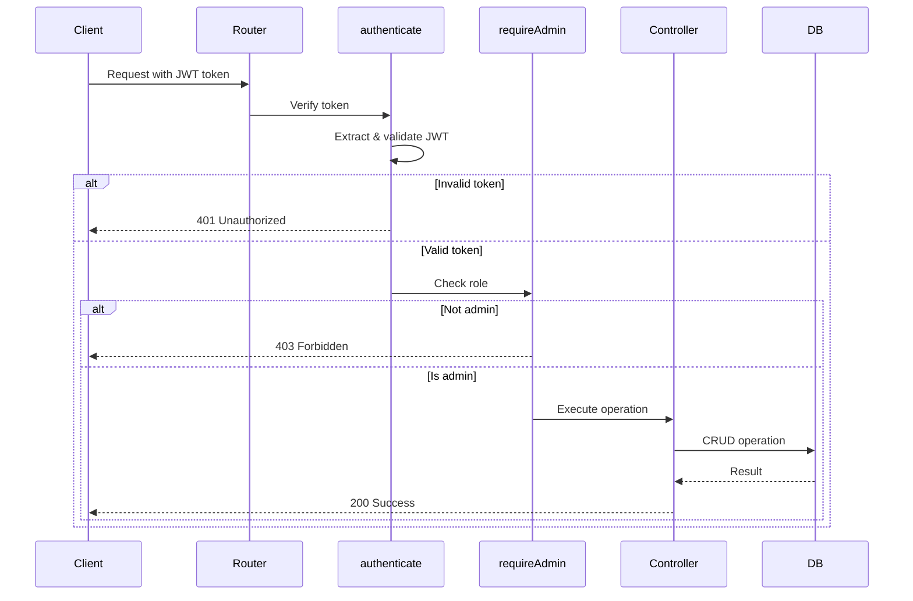

I have created the following plan after thorough exploration and analysis of the codebase. Follow the below plan verbatim. Trust the files and references. Do not re-verify what's written in the plan. Explore only when absolutely necessary. First implement all the proposed file changes and then I'll review all the changes together at the end.

## Observations

The codebase has authentication and authorization middleware already implemented and working (as seen in `file:server/src/routes/project.routes.ts`). Both `file:server/src/routes/category.routes.ts` and `file:server/src/routes/contact.routes.ts` have TODO comments indicating that authentication needs to be added. The middleware imports are commented out, and the routes are currently unprotected, allowing public access to admin-only operations.

## Approach

Following the established pattern from `file:server/src/routes/project.routes.ts`, we'll uncomment the middleware imports and apply both `authenticate` and `requireAdmin` middleware to the appropriate routes. This ensures that only authenticated admin users can perform sensitive operations like creating, updating, or deleting data. The middleware chain (`authenticate` → `requireAdmin` → controller) will verify JWT tokens and check admin role before allowing access.

## Implementation Steps

### 1. Update Category Routes (`file:server/src/routes/category.routes.ts`)

**Remove TODO comments and uncomment imports:**
- Delete lines 9-11 (TODO comment and commented imports)
- Add active imports for `authenticate` from `../middleware/auth.middleware` and `requireAdmin` from `../middleware/authorize.middleware`

**Protect POST route (Create Category):**
- Replace line 24: `router.post('/', createCategory);`
- With: `router.post('/', authenticate, requireAdmin, createCategory);`
- Remove line 25 (TODO comment)

**Protect PUT route (Update Category):**
- Replace line 28: `router.put('/:id', updateCategory);`
- With: `router.put('/:id', authenticate, requireAdmin, updateCategory);`
- Remove line 29 (TODO comment)

**Protect DELETE route (Delete Category):**
- Replace line 32: `router.delete('/:id', deleteCategory);`
- With: `router.delete('/:id', authenticate, requireAdmin, deleteCategory);`
- Remove line 33 (TODO comment)

**Keep public routes unchanged:**
- `GET /` (getAllCategories) - remains public
- `GET /:id` (getCategoryById) - remains public

---

### 2. Update Contact Routes (`file:server/src/routes/contact.routes.ts`)

**Remove TODO comments and uncomment imports:**
- Delete lines 9-11 (TODO comment and commented imports)
- Add active imports for `authenticate` from `../middleware/auth.middleware` and `requireAdmin` from `../middleware/authorize.middleware`

**Protect GET all submissions route:**
- Replace line 21: `router.get('/', getAllSubmissions);`
- With: `router.get('/', authenticate, requireAdmin, getAllSubmissions);`
- Remove line 22 (TODO comment)

**Protect GET single submission route:**
- Replace line 25: `router.get('/:id', getSubmissionById);`
- With: `router.get('/:id', authenticate, requireAdmin, getSubmissionById);`
- Remove line 26 (TODO comment)

**Protect PATCH read status route:**
- Replace line 29: `router.patch('/:id/read', updateReadStatus);`
- With: `router.patch('/:id/read', authenticate, requireAdmin, updateReadStatus);`
- Remove line 30 (TODO comment)

**Protect DELETE route:**
- Replace line 33: `router.delete('/:id', deleteSubmission);`
- With: `router.delete('/:id', authenticate, requireAdmin, deleteSubmission);`
- Remove line 34 (TODO comment)

**Keep public route unchanged:**
- `POST /` (submitContact) - remains public for contact form submissions

---

### 3. Verification Steps

After implementing the changes:

**Test protected routes return 401 without authentication:**
- Attempt to access any protected endpoint without Authorization header
- Verify response is 401 Unauthorized with message from `ERROR_MESSAGES.AUTH.TOKEN_REQUIRED`

**Test protected routes return 403 for non-admin users:**
- Authenticate as a regular user (non-admin)
- Attempt to access protected endpoints
- Verify response is 403 Forbidden with message from `ERROR_MESSAGES.AUTH.ADMIN_ACCESS_REQUIRED`

**Test protected routes work for admin users:**
- Authenticate as an admin user
- Verify all CRUD operations work correctly
- Confirm JWT token is properly validated by `authenticate` middleware
- Confirm admin role is properly checked by `requireAdmin` middleware

**Test public routes remain accessible:**
- Verify `GET /api/categories` and `GET /api/categories/:id` work without authentication
- Verify `POST /api/contact` works without authentication

---

## Security Impact

This implementation secures all admin operations, preventing unauthorized access to sensitive data management endpoints while maintaining public access to necessary routes like contact form submission and category browsing.