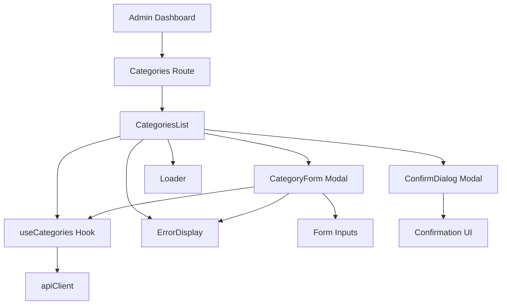
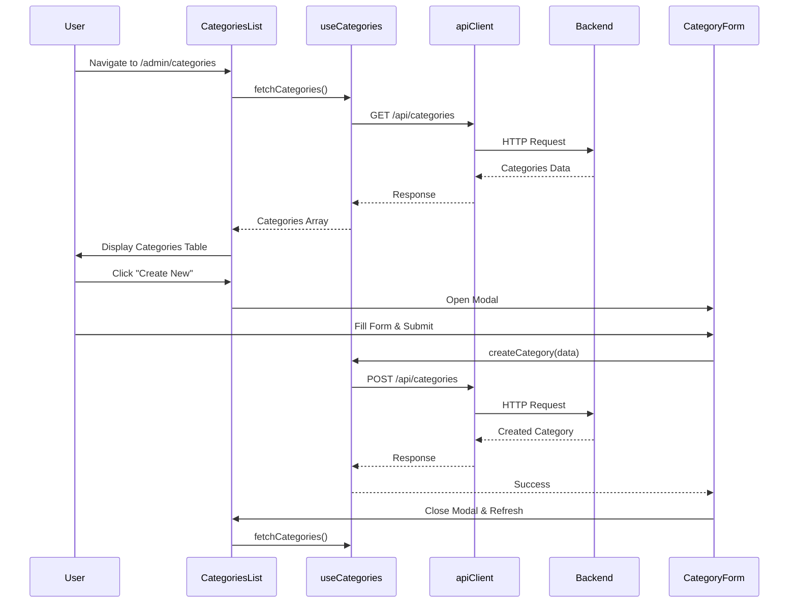

I have created the following plan after thorough exploration and analysis of the codebase. Follow the below plan verbatim. Trust the files and references. Do not re-verify what's written in the plan. Explore only when absolutely necessary. First implement all the proposed file changes and then I'll review all the changes together at the end.

## Observations

The codebase follows a clean architecture with Controller → Service → Repository pattern on the backend. Categories have a simple structure (id, title, urlCode, timestamps) with a many-to-many relationship to Projects. The backend provides full CRUD APIs at `file:server/src/routes/category.routes.ts` with validation using Zod schemas. The CategoryUrlCode enum has three values: `privateHouses`, `apartments`, `publicSpaces`. The admin dashboard shell is already implemented with sidebar navigation, and the Projects management interface provides patterns for hooks, forms, tables, and modals. The site uses RTL (Hebrew), TailwindCSS styling, and follows consistent patterns for error handling and loading states.

## Approach

Build a streamlined admin interface for category management following the established patterns from Projects management. Create a `useCategories` hook for API operations, implement a simple table-based list view with inline editing capabilities, and use a modal-based form for create/edit operations. Since categories are simpler than projects (no images, fewer fields), the interface will be more compact with inline actions. Display associated projects count for each category and prevent deletion of categories with active projects. Follow existing TailwindCSS patterns, RTL support, and the admin dashboard color scheme.

## Implementation Steps

### 0. Install React Hook Form Dependency

**File**: `file:client/package.json`

Add React Hook Form to project dependencies:

- Run: `npm install react-hook-form`
- Add to dependencies: `"react-hook-form": "^7.x.x"`
- This provides form state management, validation, and error handling
- No additional peer dependencies required

### 1. Update URLs Constants

**File**: `file:client/src/constants/urls.ts`

Expand the categories endpoints to support full CRUD operations:

- Update the `categories` object to include all endpoints:
  - `getAll: ${BACKEND_URL}/api/categories`
  - `getById: ${BACKEND_URL}/api/categories` (append `/:id`)
  - `create: ${BACKEND_URL}/api/categories`
  - `update: ${BACKEND_URL}/api/categories` (append `/:id`)
  - `delete: ${BACKEND_URL}/api/categories` (append `/:id`)

### 2. Create Categories API Hook

**File**: `file:client/src/hooks/useCategories.ts`

Create a custom hook to handle all category-related API operations:

- Import `apiClient` from `file:client/src/utils/apiClient.ts`
- Import `urls` from `file:client/src/constants/urls.ts`
- Import `useErrorHandler` from `file:client/src/hooks/useErrorHandler.ts`
- Import `useState` and `useCallback` from React
- Define `CategoryResponse` interface matching backend type (id, title, urlCode, createdAt, updatedAt)
- Define `CategoryRequest` interface (title, urlCode)
- Implement the following functions with loading states:
  - `fetchCategories()` - GET request to `urls.categories.getAll`, returns array of categories
  - `fetchCategoryById(id: string)` - GET request to `urls.categories.getById/${id}`
  - `createCategory(data: CategoryRequest)` - POST request to `urls.categories.create`
  - `updateCategory(id: string, data: Partial<CategoryRequest>)` - PUT request to `urls.categories.update/${id}`
  - `deleteCategory(id: string)` - DELETE request to `urls.categories.delete/${id}`
- Return object with: `{ categories, loading, error, fetchCategories, createCategory, updateCategory, deleteCategory, fetchCategoryById }`
- Use try-catch with `handleError` from `useErrorHandler`
- Follow the pattern from the Projects management implementation

### 3. Create Categories List Page

**File**: `file:client/src/pages/Admin/Categories/CategoriesList.tsx`

Build the main categories management page with table view:

- Import `useCategories` hook
- Import `useState`, `useEffect` from React
- Import `Loader` from `file:client/src/components/Loader`
- Import `ErrorDisplay` from `file:client/src/components/ErrorDisplay`
- Import `Modal` from `file:client/src/components/ui/Modal`
- Import `CategoryForm` component (to be created)
- Use `useState` for modal state (open/closed, create/edit mode, selected category)
- Use `useState` for delete confirmation modal
- Use `useEffect` to fetch categories on mount
- Fetch projects count for each category (use existing projects API with category filter)
- Display categories in a responsive table with columns:
  - Title (Hebrew display name)
  - URL Code (English enum value)
  - Projects Count (number of associated projects)
  - Created Date (formatted)
  - Actions (Edit, Delete buttons)
- Add "Create New Category" button at top right
- Implement delete confirmation modal showing:
  - Category title
  - Warning if category has associated projects (prevent deletion)
  - Confirmation message
- Table styling: `table-auto w-full`, header with `bg-gray-100 font-bold`, striped rows with `odd:bg-white even:bg-gray-50`
- Action buttons: `bg-primary text-white hover:bg-primary/80` for edit, `bg-red-500 hover:bg-red-600` for delete
- Disable delete button if category has projects, show tooltip explaining why
- Add RTL support with `dir="rtl"`
- Show loading state with Loader component
- Show error state with ErrorDisplay component
- Show empty state message when no categories exist

**Layout Structure**:
- Header section with title "ניהול קטגוריות" and "Create New" button
- Table section with categories
- Modal for create/edit form
- Modal for delete confirmation
- Loading/error states

### 4. Create Category Form Component

**File**: `file:client/src/pages/Admin/Categories/CategoryForm.tsx`

Build a modal-based form for creating and editing categories using React Hook Form:

- Accept props: `open: boolean`, `onClose: () => void`, `category?: CategoryResponse` (undefined for create, object for edit), `onSuccess: () => void`
- Import `useCategories` hook
- Import `useForm` and `Controller` from `react-hook-form`
- Import `Modal` from `file:client/src/components/ui/Modal`
- Import `ErrorDisplay` component
- Define form validation schema using Zod (or inline validation):
  - Title: required, min 2 chars, max 100 chars
  - URL Code: required, must be one of the enum values
- Use `useForm` hook with:
  - `defaultValues` set from category prop (for edit mode)
  - `mode: 'onBlur'` for validation on blur
  - `resolver` for Zod schema validation (optional, can use built-in validation)
- Implement form fields using `Controller`:
  - Title (text input, required, min 2 chars, max 100 chars) - Hebrew label: "שם הקטגוריה"
  - URL Code (select dropdown, required) - Hebrew label: "קוד URL"
    - Options: `privateHouses` (בתים פרטיים), `apartments` (דירות), `publicSpaces` (מרחבים ציבוריים)
- Display field-level error messages from React Hook Form
- Submit handler using `handleSubmit`:
  - For create: call `createCategory` with form data
  - For edit: call `updateCategory` with category id and changed fields
  - Show success message
  - Call `onSuccess` callback to refresh list
  - Close modal
  - Reset form on close
- Cancel button to close modal without saving
- Modal content styling: `bg-white rounded-xl shadow-md p-6 max-w-md w-full`
- Input styling: `rounded-xl border border-gray-300 p-2 w-full focus:ring-2 focus:ring-primary`
- Error input styling: `border-red-500`
- Label styling: `block text-sm font-medium mb-1 text-right`
- Error message styling: `text-red-500 text-sm mt-1 text-right`
- Button styling: `bg-primary text-white hover:bg-primary/80 rounded-xl px-4 py-2`
- Add RTL support with `dir="rtl"`
- Disable submit button during submission using `formState.isSubmitting`
- Show loading indicator on submit button when submitting

**URL Code Mapping**:
```typescript
const urlCodeLabels = {
  privateHouses: 'בתים פרטיים',
  apartments: 'דירות',
  publicSpaces: 'מרחבים ציבוריים'
};
```

**React Hook Form Setup**:
```typescript
const { control, handleSubmit, formState: { errors, isSubmitting }, reset } = useForm<CategoryFormData>({
  defaultValues: category ? { title: category.title, urlCode: category.urlCode } : { title: '', urlCode: '' },
  mode: 'onBlur'
});
```

### 5. Create Reusable Confirm Dialog Component (if not exists)

**File**: `file:client/src/components/Admin/ConfirmDialog.tsx`

Create a reusable confirmation dialog component (skip if already created in Projects phase):

- Accept props: `open: boolean`, `title: string`, `message: string`, `onConfirm: () => void`, `onCancel: () => void`, `confirmText?: string`, `cancelText?: string`, `confirmDisabled?: boolean`, `warningMessage?: string`
- Use `Modal` component from `file:client/src/components/ui/Modal`
- Display title, message, optional warning message, and action buttons
- Confirm button: `bg-red-500 hover:bg-red-600 text-white disabled:opacity-50 disabled:cursor-not-allowed`
- Cancel button: `bg-gray-300 hover:bg-gray-400 text-black`
- Add RTL support with `dir="rtl"`
- Default texts: confirmText="אישור", cancelText="ביטול"

### 6. Update Admin Routes in App.tsx

**File**: `file:client/src/App.tsx`

Add category management route to the admin section:

- Import category component with lazy loading:
  ```typescript
  const CategoriesList = lazy(() => import('./pages/Admin/Categories/CategoriesList'));
  ```
- Update the `/admin` route children array:
  - Replace `categories` placeholder with: `/admin/categories` → `<CategoriesList />`
- Wrap route element with `Suspense` and `Loader` fallback

### 7. Add Projects Count to Categories

**File**: `file:client/src/hooks/useCategories.ts`

Enhance the hook to fetch projects count for each category:

- Add `fetchCategoriesWithProjectCount()` function
- For each category, make a request to projects API with category filter
- Use `Promise.all` to fetch counts in parallel
- Return categories array with additional `projectsCount` field
- Cache results to avoid repeated fetches
- Alternative: Create a backend endpoint `/api/categories/with-counts` for better performance (optional)

### 8. Validation and Error Handling

Implement comprehensive validation and error handling with React Hook Form:

**Client-side Validation**:
- Use React Hook Form's built-in validation with `register` or `Controller`
- Required field validation (title, urlCode)
- Length validation (title: 2-100 chars) using `minLength` and `maxLength` rules
- Pattern validation for urlCode (must match enum values)
- Display field-level error messages from `formState.errors`
- Show inline error messages below each field with red text styling
- Disable submit button if form has validation errors using `formState.isValid`
- Show validation errors on blur using `mode: 'onBlur'`
- Clear errors when user corrects input

**Server-side Error Handling**:
- Handle 409 Conflict error for duplicate urlCode (show user-friendly message: "קטגוריה עם קוד זה כבר קיימת")
- Handle 404 Not Found error (show message: "קטגוריה לא נמצאה")
- Handle 409 Conflict error for deletion with projects (show message: "לא ניתן למחוק קטגוריה עם פרויקטים משויכים")
- Use `ErrorDisplay` component for displaying server errors
- Add retry functionality for network errors
- Show server errors in modal using `setError` from React Hook Form for field-level errors
- Show general errors using ErrorDisplay component for non-field errors

### 9. Styling and Responsive Design

Apply consistent styling across all category management pages:

**Colors**:
- Primary: `bg-primary text-white` (#152b44)
- Secondary: `bg-secondary` (#F2EDE9)
- Danger: `bg-red-500 hover:bg-red-600`
- Success: `bg-green-500`
- Gray: `bg-gray-100`, `bg-gray-50`

**Table Styling**:
- Container: `bg-white rounded-xl shadow-md p-6`
- Table: `table-auto w-full`
- Header: `bg-gray-100 font-bold text-right`
- Rows: `odd:bg-white even:bg-gray-50 hover:bg-gray-100 transition-colors`
- Borders: `border-b border-gray-200`
- Cell padding: `p-3`

**Form Styling**:
- Modal container: `bg-white rounded-xl shadow-md p-6 max-w-md w-full`
- Input focus: `focus:ring-2 focus:ring-primary focus:border-primary`
- Error state: `border-red-500`
- Error message: `text-red-500 text-sm mt-1 text-right`
- Success message: `text-green-500 text-sm mt-1 text-right`

**Buttons**:
- Primary: `bg-primary text-white hover:bg-primary/80 rounded-xl px-4 py-2 transition-all`
- Danger: `bg-red-500 text-white hover:bg-red-600 rounded-xl px-4 py-2 transition-all`
- Secondary: `bg-gray-300 text-black hover:bg-gray-400 rounded-xl px-4 py-2 transition-all`
- Disabled: `opacity-50 cursor-not-allowed`

**Responsive Breakpoints**:
- Mobile: Default styles, stack table cells vertically if needed
- Tablet: `md:` prefix (768px+)
- Desktop: `lg:` prefix (1024px+)

### 10. Accessibility and UX Enhancements

Add accessibility features and UX improvements:

- Add proper ARIA labels to all interactive elements
- Ensure keyboard navigation works for forms and tables
- Add focus states to all interactive elements: `focus:ring-2 focus:ring-primary`
- Use semantic HTML (`<table>`, `<form>`, `<button>`)
- Add loading indicators for async operations
- Disable submit buttons during form submission
- Show character count for title input (e.g., "50/100")
- Add confirmation dialogs for destructive actions (delete)
- Show success toast/message after create/update/delete operations
- Add tooltips for disabled delete buttons explaining why deletion is prevented
- Implement optimistic UI updates where appropriate
- Add breadcrumb navigation: "ניהול > קטגוריות"

## Component Hierarchy



## Data Flow



## URL Code to Hebrew Label Mapping

Create a constant for mapping URL codes to Hebrew labels:

```typescript
export const urlCodeLabels: Record<string, string> = {
  privateHouses: 'בתים פרטיים',
  apartments: 'דירות',
  publicSpaces: 'מרחבים ציבוריים'
};
```

Use this mapping in:
- Category form dropdown options
- Categories list table display
- Any other place where category names are shown
