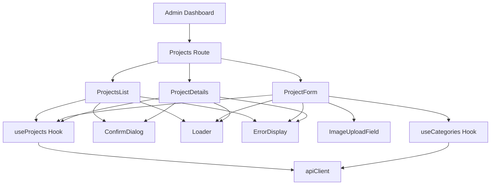
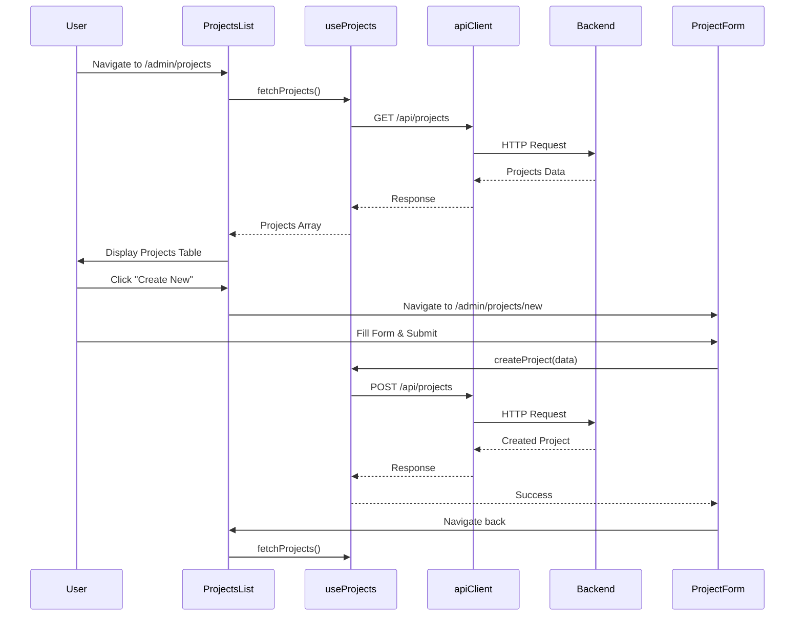

I have created the following plan after thorough exploration and analysis of the codebase. Follow the below plan verbatim. Trust the files and references. Do not re-verify what's written in the plan. Explore only when absolutely necessary. First implement all the proposed file changes and then I'll review all the changes together at the end.

## Observations

The codebase follows a clean architecture with Controller → Service → Repository pattern on the backend, using Prisma ORM with PostgreSQL. The frontend uses React Router v6, TailwindCSS with RTL support, Motion library for animations, and a centralized `apiClient` with token management. The admin dashboard shell (AdminLayout, AdminNavbar) is already implemented with sidebar navigation. Projects have complex relationships with categories and images (MAIN, IMAGE, PLAN, VIDEO types), and the backend provides comprehensive CRUD APIs with image management endpoints.

## Approach

Build a complete admin interface for project management following the existing patterns: create a custom `useProjects` hook for API calls (similar to `useEmailSend` pattern), implement a table-based list view with search/filter capabilities, create a comprehensive form component for create/edit operations with image upload support, and add a details view for viewing individual projects. Use the existing Modal component for confirmations, Loader for loading states, and ErrorDisplay for error handling. Follow the established TailwindCSS styling patterns with RTL support and the admin dashboard color scheme.

## Implementation Steps

### 1. Create Shared Project Types and Validation Schemas

**File**: `file:shared/src/types/project.types.ts`

Create shared types and Zod validation schemas for projects:

- Export `ProjectResponse` interface (already exists in server, move to shared)
- Export `ImageInput` interface (already exists in server, move to shared)
- Export `UpdateProjectInput` interface (already exists in server, move to shared)
- Create new Zod schemas:
  - `imageInputSchema` - Validate image input (url, type, order)
  - `createProjectSchema` - Validate project creation data
  - `updateProjectSchema` - Validate project update data
  - `projectFiltersSchema` - Validate filter parameters
- Export TypeScript types inferred from Zod schemas:
  - `CreateProjectInput = z.infer<typeof createProjectSchema>`
  - `UpdateProjectInput = z.infer<typeof updateProjectSchema>`
  - `ProjectFilters = z.infer<typeof projectFiltersSchema>`
- Follow the pattern from `file:server/src/validators/project.validators.ts`

**Zod Schema Details**:
```typescript
export const imageInputSchema = z.object({
  url: z.string().url('Image URL must be a valid URL'),
  type: z.enum(['MAIN', 'IMAGE', 'PLAN', 'VIDEO']),
  order: z.number().int().nonnegative().optional(),
});

export const createProjectSchema = z.object({
  title: z.string().min(1, 'Title is required').max(500),
  description: z.string().min(1, 'Description is required'),
  location: z.string().min(1, 'Location is required').max(200),
  client: z.string().min(1, 'Client is required').max(200),
  isCompleted: z.boolean().default(false),
  constructionArea: z.number().int().positive('Must be positive'),
  favourite: z.boolean().default(false),
  categoryIds: z.array(z.string()).min(1, 'At least one category required'),
  images: z.array(imageInputSchema).default([]),
});

export const updateProjectSchema = createProjectSchema.partial().extend({
  id: z.string(),
});

export const projectFiltersSchema = z.object({
  category: z.string().optional(),
  favourite: z.boolean().optional(),
  isCompleted: z.boolean().optional(),
});
```

**File**: `file:shared/src/index.ts`

Update shared exports to include project types and schemas:

- Export all types and schemas from `./types/project.types.ts`

### 2. Create Projects API Hook

**File**: `file:client/src/hooks/useProjects.ts`

Create a custom hook to handle all project-related API operations:

- Import `apiClient` from `file:client/src/utils/apiClient.ts`
- Import `urls` from `file:client/src/constants/urls.ts`
- Import `useErrorHandler` from `file:client/src/hooks/useErrorHandler.ts`
- Import types from `@shirans/shared`: `ProjectResponse`, `CreateProjectInput`, `UpdateProjectInput`, `ImageInput`
- Use `useState` for loading states and errors
- Implement the following functions:
  - `fetchProjects(filters?: ProjectFilters)` - GET request to `urls.projects` with query params
  - `fetchProjectById(id: string)` - GET request to `urls.singleProject?id=${id}`
  - `createProject(data: CreateProjectInput)` - POST request to `urls.projects`
  - `updateProject(id: string, data: UpdateProjectInput)` - PUT request to `urls.updateProject` with id in body
  - `deleteProject(id: string)` - DELETE request to `urls.projects` with id in body
  - `uploadImages(id: string, images: ImageInput[])` - POST request to `urls.uploadImgs`
  - `deleteMainImage(id: string)` - DELETE request to `urls.deleteMainImage`
  - `deleteImages(id: string, imageIds: string[])` - DELETE request to `urls.deleteProjectImages`
- Return object with all functions, loading states, and errors
- Use try-catch with `handleError` from `useErrorHandler`
- Follow the pattern from `file:client/src/components/Footer/hooks/useEmailSend.tsx`

### 2. Create Projects List Page

**File**: `file:client/src/pages/Admin/Projects/ProjectsList.tsx`

Build the main projects management page with table view:

- Import `useProjects` hook
- Import `useNavigate` from `react-router-dom`
- Import `Loader` from `file:client/src/components/Loader`
- Import `ErrorDisplay` from `file:client/src/components/ErrorDisplay`
- Import `Modal` from `file:client/src/components/ui/Modal`
- Use `useState` for search term, filters, and delete confirmation modal
- Use `useEffect` to fetch projects on mount
- Implement search functionality (filter by title, client, location)
- Implement filter dropdowns:
  - Category filter (fetch categories from API)
  - Favourite filter (All / Favourites Only)
  - Status filter (All / Completed / In Progress)
- Display projects in a responsive table with columns:
  - Main Image (thumbnail)
  - Title
  - Client
  - Location
  - Categories (badges)
  - Status (Completed/In Progress badge)
  - Favourite (star icon)
  - Actions (View, Edit, Delete buttons)
- Add "Create New Project" button at top right
- Implement delete confirmation modal with project title
- Add pagination if needed (optional for now)
- Use TailwindCSS classes: `bg-white rounded-xl shadow-md p-6`
- Table styling: `table-auto w-full`, striped rows with `odd:bg-gray-50`
- Action buttons: `bg-primary text-white hover:bg-primary/80` for view/edit, `bg-red-500 hover:bg-red-600` for delete
- Add RTL support with `dir="rtl"`

**Layout Structure**:
- Header section with title and "Create New" button
- Search and filter section
- Table section with projects
- Loading state with Loader component
- Error state with ErrorDisplay component
- Empty state message when no projects found

### 3. Create Project Form Component

**File**: `file:client/src/pages/Admin/Projects/ProjectForm.tsx`

Build a comprehensive form for creating and editing projects:

- Accept props: `projectId?: string` (undefined for create, string for edit)
- Import `useProjects` hook
- Import `useNavigate` from `react-router-dom`
- Import `Loader` and `ErrorDisplay` components
- Use `useState` for form data, validation errors, and image previews
- Use `useEffect` to fetch project data if `projectId` is provided
- Implement form fields:
  - Title (text input, required, max 500 chars)
  - Description (textarea, required)
  - Location (text input, required, max 200 chars)
  - Client (text input, required, max 200 chars)
  - Construction Area (number input, required, positive integer)
  - Is Completed (checkbox)
  - Favourite (checkbox)
  - Categories (multi-select checkboxes - fetch from categories API)
- Implement image management section:
  - Main Image upload (single image, type: MAIN)
  - Gallery Images upload (multiple images, type: IMAGE)
  - Plan Images upload (multiple images, type: PLAN)
  - Video URLs input (multiple URLs, type: VIDEO)
  - Show image previews with delete button
  - Support drag-and-drop for image ordering
- Form validation:
  - Required fields validation
  - Max length validation
  - At least one category required
  - At least one main image required
- Submit handler:
  - For create: call `createProject` with all data including images
  - For edit: call `updateProject` with changed fields only
  - Handle image uploads separately if needed
  - Show success message and navigate back to list
- Cancel button to navigate back without saving
- Form styling: `bg-white rounded-xl shadow-md p-6`
- Input styling: `rounded-xl border border-gray-300 p-2 w-full`
- Label styling: `block text-sm font-medium mb-1`
- Button styling: `bg-primary text-white hover:bg-primary/80 rounded-xl px-4 py-2`
- Add RTL support with `dir="rtl"`

**Image Upload Strategy**:
- For now, use text input for image URLs (actual file upload can be added later)
- Store images in state as array of `ImageInput` objects
- Allow adding/removing images before submission
- Include all images in the create/update request

### 4. Create Project Details Page

**File**: `file:client/src/pages/Admin/Projects/ProjectDetails.tsx`

Build a read-only view for viewing project details:

- Accept `projectId` from URL params using `useParams`
- Import `useProjects` hook
- Import `useNavigate` from `react-router-dom`
- Import `Loader` and `ErrorDisplay` components
- Use `useEffect` to fetch project data on mount
- Display all project information in a structured layout:
  - Header with title and action buttons (Edit, Delete, Back)
  - Main image section (large display)
  - Project details section (grid layout):
    - Client
    - Location
    - Construction Area
    - Status (Completed/In Progress)
    - Favourite status
    - Categories (badges)
    - Description
  - Image gallery section (grid of images)
  - Plans section (if available)
  - Videos section (if available)
- Edit button navigates to form with project ID
- Delete button shows confirmation modal
- Back button navigates to projects list
- Use card-based layout with `bg-white rounded-xl shadow-md p-6`
- Image grid: `grid grid-cols-2 md:grid-cols-3 lg:grid-cols-4 gap-4`
- Add RTL support with `dir="rtl"`

### 5. Update Admin Routes in App.tsx

**File**: `file:client/src/App.tsx`

Add project management routes to the admin section:

- Import project components with lazy loading:
  ```typescript
  const ProjectsList = lazy(() => import('./pages/Admin/Projects/ProjectsList'));
  const ProjectForm = lazy(() => import('./pages/Admin/Projects/ProjectForm'));
  const ProjectDetails = lazy(() => import('./pages/Admin/Projects/ProjectDetails'));
  ```
- Update the `/admin` route children array:
  - Replace `projects` placeholder with actual routes
  - Add nested routes:
    - `/admin/projects` → `<ProjectsList />`
    - `/admin/projects/new` → `<ProjectForm />`
    - `/admin/projects/:id` → `<ProjectDetails />`
    - `/admin/projects/:id/edit` → `<ProjectForm />`
- Wrap each route element with `Suspense` and `Loader` fallback

### 6. Create Reusable Components

**File**: `file:client/src/components/Admin/ConfirmDialog.tsx`

Create a reusable confirmation dialog component:

- Accept props: `open: boolean`, `title: string`, `message: string`, `onConfirm: () => void`, `onCancel: () => void`, `confirmText?: string`, `cancelText?: string`
- Use `Modal` component from `file:client/src/components/ui/Modal`
- Display title, message, and action buttons
- Confirm button: `bg-red-500 hover:bg-red-600 text-white`
- Cancel button: `bg-gray-300 hover:bg-gray-400 text-black`
- Add RTL support

**File**: `file:client/src/components/Admin/ImageUploadField.tsx`

Create a reusable image upload field component:

- Accept props: `label: string`, `images: ImageInput[]`, `onChange: (images: ImageInput[]) => void`, `type: 'MAIN' | 'IMAGE' | 'PLAN' | 'VIDEO'`, `multiple?: boolean`
- Display current images with preview and delete button
- Add new image input (URL for now)
- Support multiple images if `multiple` is true
- Show image count and type label
- Styling consistent with form inputs

### 7. Add Categories API Support

**File**: `file:client/src/hooks/useCategories.ts`

Create a hook to fetch categories for the form:

- Import `apiClient` and `urls`
- Implement `fetchCategories()` function
- GET request to `urls.categories.getAll`
- Return categories array with loading and error states
- Cache categories in state to avoid repeated fetches

### 8. Styling and Responsive Design

Apply consistent styling across all project management pages:

**Colors**:
- Primary: `bg-primary text-white` (#152b44)
- Secondary: `bg-secondary` (#F2EDE9)
- Success: `bg-green-500`
- Danger: `bg-red-500`
- Warning: `bg-yellow-500`
- Info: `bg-blue-500`

**Badges**:
- Category badges: `bg-primary text-white text-xs px-2 py-1 rounded-full`
- Status badges: `bg-green-500 text-white text-xs px-2 py-1 rounded-full` (completed), `bg-yellow-500 text-black text-xs px-2 py-1 rounded-full` (in progress)
- Favourite icon: `text-yellow-500` (filled star)

**Tables**:
- Header: `bg-gray-100 font-bold`
- Rows: `odd:bg-white even:bg-gray-50 hover:bg-gray-100`
- Borders: `border-b border-gray-200`

**Forms**:
- Input focus: `focus:ring-2 focus:ring-primary focus:border-primary`
- Error state: `border-red-500`
- Error message: `text-red-500 text-sm mt-1`

**Responsive Breakpoints**:
- Mobile: Default styles
- Tablet: `md:` prefix (768px+)
- Desktop: `lg:` prefix (1024px+)

### 9. Error Handling and Loading States

Implement consistent error handling and loading states:

- Use `Loader` component for loading states
- Use `ErrorDisplay` component for errors with retry option
- Show inline validation errors in forms
- Display success messages after create/update/delete operations
- Use toast notifications for non-blocking feedback (optional)
- Handle network errors gracefully with retry functionality

### 10. Accessibility and UX Enhancements

Add accessibility features and UX improvements:

- Add proper ARIA labels to all interactive elements
- Ensure keyboard navigation works for all forms and tables
- Add focus states to all interactive elements
- Use semantic HTML (`<table>`, `<form>`, `<button>`)
- Add loading indicators for async operations
- Disable submit buttons during form submission
- Show character count for text inputs with max length
- Add confirmation dialogs for destructive actions
- Implement optimistic UI updates where appropriate
- Add breadcrumb navigation (Admin > Projects > Details)

## Component Hierarchy



## Data Flow


