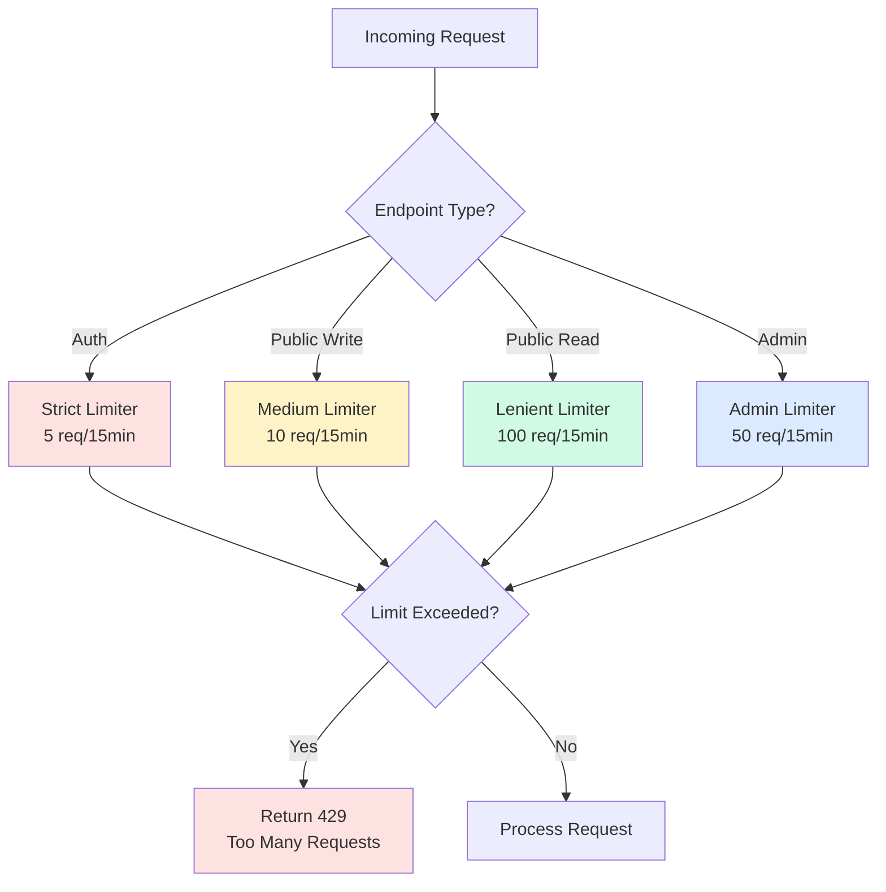

# Backend Rate Limiting Enhancement

## Overview

Expand the existing rate limiting implementation from auth-only endpoints to comprehensive, tiered rate limiting across all API endpoints. This will protect the backend from abuse, DDoS attacks, and ensure fair resource usage.

## Motivation

Currently, rate limiting exists only on auth endpoints (`file:server/src/middleware/rateLimiter.ts`). This leaves other endpoints vulnerable:
- **Contact form** (`POST /api/contact`) - susceptible to spam
- **Public read endpoints** - susceptible to scraping/DDoS
- **Admin endpoints** - no additional protection beyond auth

A comprehensive rate limiting strategy will:
- Prevent abuse and spam
- Protect server resources
- Ensure fair usage
- Improve security posture

## Current State Analysis

**Existing Implementation:**
```typescript
// file:server/src/middleware/rateLimiter.ts
- Uses express-rate-limit (already installed)
- authLimiter: 5 requests per 15 minutes
- Applied only to auth routes
- Skips in test environment
```

**Current Route Coverage:**
- ✅ Auth routes: `/api/auth/*` (5 req/15min)
- ❌ Contact routes: `/api/contact` (no limit)
- ❌ Project routes: `/api/projects/*` (no limit)
- ❌ Category routes: `/api/categories/*` (no limit)

**Vulnerabilities:**
1. Contact form spam (no limit on POST /api/contact)
2. API scraping (no limit on GET endpoints)
3. Admin endpoint abuse (only auth protection)

## Requirements

### Functional Requirements

1. **Tiered Rate Limiting**
   - **Strict**: Auth endpoints (5 req/15min) - existing
   - **Medium**: Public write endpoints (10 req/15min) - contact form
   - **Lenient**: Public read endpoints (100 req/15min) - projects, categories
   - **Admin**: Protected endpoints (50 req/15min) - admin operations

2. **Endpoint-Specific Limits**
   - Different limits for different endpoint types
   - Configurable per route
   - Environment-based configuration

3. **Rate Limit Headers**
   - Return standard rate limit headers
   - `RateLimit-Limit`: Max requests allowed
   - `RateLimit-Remaining`: Requests remaining
   - `RateLimit-Reset`: Time until reset

4. **Error Responses**
   - Clear error messages (Hebrew support)
   - HTTP 429 (Too Many Requests)
   - Retry-After header

5. **IP-Based Tracking**
   - Track by IP address
   - Support for proxies (trust proxy)
   - Optional: Track by user ID for authenticated requests

### Non-Functional Requirements

1. **Performance**: Minimal latency overhead (<5ms)
2. **Scalability**: Support distributed rate limiting (Redis-ready)
3. **Monitoring**: Log rate limit violations
4. **Configuration**: Environment-based limits
5. **Testing**: Skip rate limits in test environment

## Technical Approach

### Rate Limiting Strategy



### Rate Limit Tiers

| Tier | Use Case | Window | Max Requests | Endpoints |
|------|----------|--------|--------------|-----------|
| **Strict** | Authentication | 15 min | 5 | `/api/auth/*` |
| **Medium** | Public writes | 15 min | 10 | `/api/contact` (POST) |
| **Lenient** | Public reads | 15 min | 100 | `/api/projects/*` (GET), `/api/categories/*` (GET) |
| **Admin** | Admin operations | 15 min | 50 | Admin routes (POST/PUT/DELETE) |

### File Structure

```
server/src/
├── middleware/
│   └── rateLimiter.ts           # Enhanced with multiple limiters
├── constants/
│   └── rateLimits.constants.ts  # Rate limit configurations
└── routes/
    ├── auth.routes.ts           # Uses strictLimiter
    ├── contact.routes.ts        # Uses mediumLimiter
    ├── project.routes.ts        # Uses lenientLimiter + adminLimiter
    └── category.routes.ts       # Uses lenientLimiter + adminLimiter
```

### Implementation Details

#### 1. Rate Limit Constants

Create `file:server/src/constants/rateLimits.constants.ts`:
```typescript
export const RATE_LIMITS = {
  STRICT: {
    windowMs: 15 * 60 * 1000,  // 15 minutes
    max: 5,
    message: 'Too many authentication attempts'
  },
  MEDIUM: {
    windowMs: 15 * 60 * 1000,
    max: 10,
    message: 'Too many requests, please try again later'
  },
  LENIENT: {
    windowMs: 15 * 60 * 1000,
    max: 100,
    message: 'Too many requests, please slow down'
  },
  ADMIN: {
    windowMs: 15 * 60 * 1000,
    max: 50,
    message: 'Too many admin operations'
  }
};
```

#### 2. Enhanced Rate Limiter Middleware

Update `file:server/src/middleware/rateLimiter.ts`:
- Create multiple limiter instances
- Export: `strictLimiter`, `mediumLimiter`, `lenientLimiter`, `adminLimiter`
- Configure standard headers
- Add custom error messages
- Skip in test environment

#### 3. Apply to Routes

**Contact Routes** (`file:server/src/routes/contact.routes.ts`):
```typescript
// Public write - medium limit
router.post('/', mediumLimiter, submitContact);

// Admin reads - lenient limit
router.get('/', lenientLimiter, authenticate, requireAdmin, getAllSubmissions);
```

**Project Routes** (`file:server/src/routes/project.routes.ts`):
```typescript
// Public reads - lenient limit
router.get('/', lenientLimiter, getAllProjects);
router.get('/favourites', lenientLimiter, getFavouriteProjects);

// Admin writes - admin limit
router.post('/', adminLimiter, authenticate, requireAdmin, createProject);
router.put('/', adminLimiter, authenticate, requireAdmin, updateProject);
```

**Category Routes** (`file:server/src/routes/category.routes.ts`):
```typescript
// Public reads - lenient limit
router.get('/', lenientLimiter, getAllCategories);

// Admin writes - admin limit
router.post('/', adminLimiter, authenticate, requireAdmin, createCategory);
```

#### 4. Environment Configuration

Add to `.env`:
```
# Rate Limiting
RATE_LIMIT_STRICT_MAX=5
RATE_LIMIT_MEDIUM_MAX=10
RATE_LIMIT_LENIENT_MAX=100
RATE_LIMIT_ADMIN_MAX=50
RATE_LIMIT_WINDOW_MS=900000  # 15 minutes
```

#### 5. Trust Proxy Configuration

Update `file:server/src/app.ts`:
```typescript
// Trust first proxy (for accurate IP tracking)
app.set('trust proxy', 1);
```

### Advanced Features (Future)

#### Redis-Based Rate Limiting

For distributed systems:
```typescript
import RedisStore from 'rate-limit-redis';
import { createClient } from 'redis';

const redisClient = createClient({ url: process.env.REDIS_URL });

export const strictLimiter = rateLimit({
  store: new RedisStore({
    client: redisClient,
    prefix: 'rl:strict:',
  }),
  // ... other config
});
```

#### User-Based Rate Limiting

For authenticated requests:
```typescript
export const userBasedLimiter = rateLimit({
  keyGenerator: (req) => {
    // Use user ID if authenticated, otherwise IP
    return req.user?.id || req.ip;
  },
  // ... other config
});
```

## Implementation Examples

### Example 1: Enhanced rateLimiter.ts

```typescript
import rateLimit from 'express-rate-limit';
import { env } from '@/utils/env';
import { RATE_LIMITS } from '@/constants/rateLimits.constants';

const createLimiter = (config: typeof RATE_LIMITS.STRICT) => {
  return rateLimit({
    windowMs: config.windowMs,
    max: config.max,
    message: config.message,
    standardHeaders: true,
    legacyHeaders: false,
    skip: () => env.NODE_ENV === 'test',
  });
};

export const strictLimiter = createLimiter(RATE_LIMITS.STRICT);
export const mediumLimiter = createLimiter(RATE_LIMITS.MEDIUM);
export const lenientLimiter = createLimiter(RATE_LIMITS.LENIENT);
export const adminLimiter = createLimiter(RATE_LIMITS.ADMIN);

// Backward compatibility
export const authLimiter = strictLimiter;
```

### Example 2: Contact Routes with Rate Limiting

```typescript
import { Router } from 'express';
import { mediumLimiter, lenientLimiter } from '../middleware/rateLimiter';
import { authenticate } from '../middleware/auth.middleware';
import { requireAdmin } from '../middleware/authorize.middleware';
import {
  submitContact,
  getAllSubmissions,
  // ... other controllers
} from '../controllers/contact.controller';

const router = Router();

// Public write - medium limit (prevent spam)
router.post('/', mediumLimiter, submitContact);

// Admin reads - lenient limit
router.get('/', lenientLimiter, authenticate, requireAdmin, getAllSubmissions);

export default router;
```

### Example 3: Custom Error Response

```typescript
export const mediumLimiter = rateLimit({
  // ... config
  handler: (req, res) => {
    res.status(429).json({
      success: false,
      message: 'יותר מדי בקשות. אנא נסה שוב מאוחר יותר',
      retryAfter: Math.ceil(req.rateLimit.resetTime / 1000),
    });
  },
});
```

## Testing Strategy

1. **Unit Tests**
   - Test each limiter configuration
   - Test skip in test environment
   - Test custom error messages

2. **Integration Tests**
   - Test rate limit enforcement on each endpoint
   - Test rate limit headers
   - Test 429 responses
   - Test reset after window

3. **Load Tests**
   - Simulate high traffic
   - Verify rate limits hold under load
   - Test performance impact

## Monitoring & Logging

### Rate Limit Violations

Log when limits are hit:
```typescript
export const mediumLimiter = rateLimit({
  // ... config
  handler: (req, res) => {
    logger.warn('Rate limit exceeded', {
      ip: req.ip,
      path: req.path,
      method: req.method,
    });
    // ... send response
  },
});
```

### Metrics to Track

- Rate limit hits per endpoint
- Most frequently limited IPs
- Average requests per IP
- Rate limit effectiveness

## Migration Strategy

1. **Phase 1**: Create rate limit constants and enhanced middleware
2. **Phase 2**: Apply medium limiter to contact form
3. **Phase 3**: Apply lenient limiter to public read endpoints
4. **Phase 4**: Apply admin limiter to admin endpoints
5. **Phase 5**: Monitor and adjust limits based on usage patterns

## Security Considerations

1. **DDoS Protection**: Rate limiting is first line of defense
2. **Brute Force**: Strict limits on auth prevent brute force
3. **Spam Prevention**: Medium limits on contact form prevent spam
4. **Resource Protection**: Lenient limits prevent API scraping
5. **IP Spoofing**: Trust proxy configuration for accurate IP tracking

## Configuration Reference

### Environment Variables

```bash
# Rate Limiting Configuration
RATE_LIMIT_STRICT_MAX=5          # Auth endpoints
RATE_LIMIT_MEDIUM_MAX=10         # Public writes (contact)
RATE_LIMIT_LENIENT_MAX=100       # Public reads (projects, categories)
RATE_LIMIT_ADMIN_MAX=50          # Admin operations
RATE_LIMIT_WINDOW_MS=900000      # 15 minutes in milliseconds

# Proxy Configuration
TRUST_PROXY=1                    # Trust first proxy for IP tracking
```

### Rate Limit Headers

Clients will receive:
```
RateLimit-Limit: 100
RateLimit-Remaining: 95
RateLimit-Reset: 1640000000
```

On limit exceeded:
```
HTTP/1.1 429 Too Many Requests
Retry-After: 900
RateLimit-Limit: 100
RateLimit-Remaining: 0
RateLimit-Reset: 1640000900
```

## Dependencies

- ✅ `express-rate-limit` (already installed)
- Optional: `rate-limit-redis` (for distributed systems)
- No breaking changes to existing code

## Success Metrics

- ✅ Rate limiting on all public endpoints
- ✅ Tiered limits implemented (strict, medium, lenient, admin)
- ✅ Rate limit headers returned
- ✅ Custom error messages (Hebrew)
- ✅ Test environment skip working
- ✅ Monitoring/logging in place
- ✅ No performance degradation (<5ms overhead)
- ✅ Integration tests passing