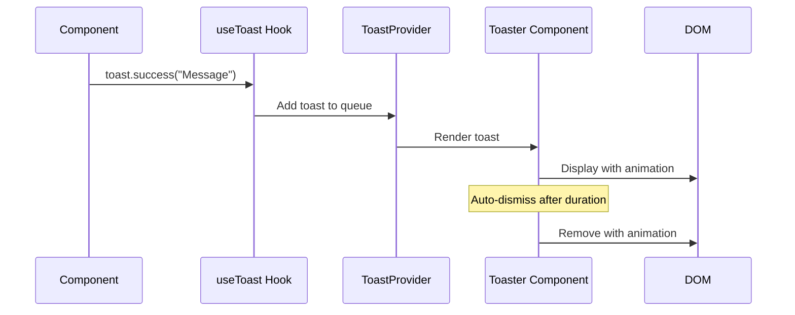

# Frontend Notifications/Toasts System

## Overview

Implement a comprehensive, accessible toast notification system for the frontend to provide user feedback for actions, errors, warnings, and success messages. The system should be lightweight, customizable, and integrate seamlessly with the existing error handling infrastructure.

## Motivation

Currently, the application lacks a unified way to show transient feedback to users. Error messages are displayed inline via file:client/src/components/ErrorDisplay/ErrorDisplay.tsx, but there's no system for:

- Success confirmations (e.g., "Form submitted successfully")
- Warning messages (e.g., "Session expiring soon")
- Info notifications (e.g., "New content available")
- Dismissible error toasts

A toast system will improve UX by providing non-intrusive, consistent feedback across the application.

## Current State Analysis

**Existing Infrastructure:**

- ✅ Error handling utilities in file:client/src/utils/errorHandler.ts
- ✅ `useErrorHandler` hook in file:client/src/hooks/useErrorHandler.ts
- ✅ ErrorDisplay component (inline, not toast-based)
- ❌ No toast library installed
- ❌ No toast context or provider
- ❌ No toast component

**Package Analysis:**  
Current file:client/package.json has no toast libraries. We need to add one.

## Requirements

### Functional Requirements

1. **Toast Types**: Support 4 toast variants
  - Success (green) - confirmations
  - Error (red) - errors and failures
  - Warning (yellow/orange) - warnings
  - Info (blue) - informational messages
2. **Toast Features**
  - Auto-dismiss with configurable duration (default: 3-5 seconds)
  - Manual dismiss via close button
  - Stacking/queuing of multiple toasts
  - Position configuration (top-right, top-center, bottom-right, etc.)
  - RTL support (Hebrew text)
  - Accessibility (ARIA labels, keyboard navigation)
3. **Integration Points**
  - Hook into existing error handler (file:client/src/utils/errorHandler.ts)
  - Provide React hook for programmatic toast triggering
  - Support toast from async operations (API calls)
4. **Animation**
  - Smooth enter/exit animations
  - Respect user's motion preferences (`prefers-reduced-motion`)

### Non-Functional Requirements

1. **Performance**: Minimal bundle size impact (<10KB gzipped)
2. **Accessibility**: WCAG 2.1 AA compliant
3. **Styling**: Match existing Tailwind design system
4. **RTL**: Full RTL support for Hebrew content

## Technical Approach

### Library Selection

**Recommended: Sonner**

- Lightweight (~3KB gzipped)
- Beautiful default animations
- Excellent TypeScript support
- Customizable with Tailwind
- Built-in promise handling
- RTL support

**Alternative: react-hot-toast**

- Also lightweight (~5KB)
- Good customization
- Simpler API

### Architecture



### File Structure

```
client/src/
├── components/
│   └── ui/
│       └── Toast/
│           ├── index.tsx          # Re-exports
│           ├── ToastProvider.tsx  # Context provider
│           └── Toaster.tsx        # Toast container component
├── hooks/
│   └── useToast.ts               # Hook for triggering toasts
└── utils/
    └── errorHandler.ts           # Enhanced to trigger toasts
```

### Implementation Details

#### 1. Install Sonner

```bash
npm install sonner
```

#### 2. Toast Provider Setup

Create client/src/components/ui/Toast/ToastProvider.tsx:

- Wrap app with Toaster component from sonner
- Configure default options (position, duration, RTL)
- Apply Tailwind styling

#### 3. useToast Hook

Create client/src/hooks/useToast.ts:

- Export wrapper around sonner's toast function
- Provide typed methods: `toast.success()`, `toast.error()`, `toast.warning()`, `toast.info()`
- Support custom options (duration, action buttons, etc.)

#### 4. Integration with Error Handler

Enhance file:client/src/utils/errorHandler.ts:

- Add optional toast triggering in `logError()` function
- Map error types to appropriate toast variants
- Avoid duplicate toasts for same error

#### 5. App Integration

Update file:client/src/App.tsx:

- Add ToastProvider at root level (after HelmetProvider)
- Ensure toasts render above all content (z-index)

### Configuration

**Default Toast Settings:**

- Position: `top-right` (RTL-aware)
- Duration: 4000ms (4 seconds)
- Max visible: 3 toasts
- Gap: 8px between toasts
- Close button: Always visible
- Dismiss on click: Optional

**Styling:**

- Use Tailwind classes for consistency
- Match existing color palette
- Support dark mode (if applicable)

## UI Wireframes

### Toast Notification Examples

```wireframe
<!DOCTYPE html>
<html dir="rtl">
<head>
<style>
  body {
    font-family: -apple-system, BlinkMacSystemFont, 'Segoe UI', sans-serif;
    background: #f5f5f5;
    padding: 20px;
    direction: rtl;
  }
  .toast-container {
    position: fixed;
    top: 20px;
    left: 20px;
    display: flex;
    flex-direction: column;
    gap: 12px;
    z-index: 9999;
  }
  .toast {
    background: white;
    border-radius: 8px;
    padding: 16px;
    box-shadow: 0 4px 12px rgba(0,0,0,0.15);
    display: flex;
    align-items: center;
    gap: 12px;
    min-width: 300px;
    max-width: 400px;
    border-right: 4px solid;
  }
  .toast.success { border-right-color: #10b981; }
  .toast.error { border-right-color: #ef4444; }
  .toast.warning { border-right-color: #f59e0b; }
  .toast.info { border-right-color: #3b82f6; }
  .toast-icon {
    width: 24px;
    height: 24px;
    border-radius: 50%;
    display: flex;
    align-items: center;
    justify-content: center;
    font-size: 14px;
    flex-shrink: 0;
  }
  .toast.success .toast-icon { background: #d1fae5; color: #10b981; }
  .toast.error .toast-icon { background: #fee2e2; color: #ef4444; }
  .toast.warning .toast-icon { background: #fef3c7; color: #f59e0b; }
  .toast.info .toast-icon { background: #dbeafe; color: #3b82f6; }
  .toast-content {
    flex: 1;
  }
  .toast-title {
    font-weight: 600;
    margin: 0 0 4px 0;
    font-size: 14px;
  }
  .toast-message {
    margin: 0;
    font-size: 13px;
    color: #6b7280;
  }
  .toast-close {
    background: none;
    border: none;
    cursor: pointer;
    padding: 4px;
    color: #9ca3af;
    font-size: 18px;
    line-height: 1;
  }
  .toast-close:hover {
    color: #4b5563;
  }
  .demo-section {
    margin-top: 60px;
    background: white;
    padding: 20px;
    border-radius: 8px;
  }
  .demo-section h2 {
    margin-top: 0;
  }
</style>
</head>
<body>
  <div class="toast-container">
    <div class="toast success" data-element-id="toast-success">
      <div class="toast-icon">✓</div>
      <div class="toast-content">
        <p class="toast-title">הצלחה!</p>
        <p class="toast-message">הפרויקט נשמר בהצלחה</p>
      </div>
      <button class="toast-close" data-element-id="close-success">×</button>
    </div>

    <div class="toast error" data-element-id="toast-error">
      <div class="toast-icon">✕</div>
      <div class="toast-content">
        <p class="toast-title">שגיאה</p>
        <p class="toast-message">לא ניתן להתחבר לשרת. אנא נסה שוב</p>
      </div>
      <button class="toast-close" data-element-id="close-error">×</button>
    </div>

    <div class="toast warning" data-element-id="toast-warning">
      <div class="toast-icon">⚠</div>
      <div class="toast-content">
        <p class="toast-title">אזהרה</p>
        <p class="toast-message">ההפעלה שלך עומדת לפוג בעוד 5 דקות</p>
      </div>
      <button class="toast-close" data-element-id="close-warning">×</button>
    </div>

    <div class="toast info" data-element-id="toast-info">
      <div class="toast-icon">ℹ</div>
      <div class="toast-content">
        <p class="toast-title">מידע</p>
        <p class="toast-message">תוכן חדש זמין לצפייה</p>
      </div>
      <button class="toast-close" data-element-id="close-info">×</button>
    </div>
  </div>

  <div class="demo-section">
    <h2>דוגמאות שימוש</h2>
    <p><strong>הצלחה:</strong> שמירת טופס, יצירת פריט, עדכון מוצלח</p>
    <p><strong>שגיאה:</strong> כשלון בשליחה, שגיאת רשת, אימות נכשל</p>
    <p><strong>אזהרה:</strong> פעולה מסוכנת, פג תוקף, מגבלה מתקרבת</p>
    <p><strong>מידע:</strong> עדכונים כלליים, טיפים, הודעות מערכת</p>
  </div>
</body>
</html>
```

## Integration Examples

### Example 1: Success Toast on Form Submit

```typescript
// In a component
import { useToast } from '@/hooks/useToast';

const { toast } = useToast();

const handleSubmit = async (data) => {
  try {
    await submitForm(data);
    toast.success('הטופס נשלח בהצלחה');
  } catch (error) {
    toast.error('שגיאה בשליחת הטופס');
  }
};
```

### Example 2: Error Handler Integration

```typescript
// Enhanced errorHandler.ts
export function logError(error: unknown, context?: string, showToast = true): void {
  const appError = transformError(error);
  
  if (showToast) {
    toast.error(appError.message);
  }
  
  // Existing logging logic...
}
```

### Example 3: Promise-based Toast

```typescript
// Loading state with promise
toast.promise(
  saveProject(data),
  {
    loading: 'שומר פרויקט...',
    success: 'הפרויקט נשמר בהצלחה',
    error: 'שגיאה בשמירת הפרויקט'
  }
);
```

## Testing Considerations

1. **Unit Tests**
  - Test toast hook functionality
  - Test toast provider configuration
  - Test integration with error handler
2. **Integration Tests**
  - Test toast display on user actions
  - Test auto-dismiss timing
  - Test manual dismiss
  - Test multiple toasts stacking
3. **Accessibility Tests**
  - Screen reader announcements
  - Keyboard navigation
  - Focus management

## Migration Strategy

1. **Phase 1**: Install and configure toast system
2. **Phase 2**: Integrate with error handler
3. **Phase 3**: Add success toasts to key user actions (auth, forms)
4. **Phase 4**: Replace inline error displays where appropriate
5. **Phase 5**: Add info/warning toasts for edge cases

## Dependencies

- `sonner` package (~3KB gzipped)
- No breaking changes to existing code
- Backward compatible with existing ErrorDisplay component

## Success Metrics

- ✅ Toast system installed and configured
- ✅ All 4 toast types working (success, error, warning, info)
- ✅ RTL support verified
- ✅ Accessibility compliance verified
- ✅ Integration with error handler complete
- ✅ At least 5 user actions showing toasts

&nbsp;