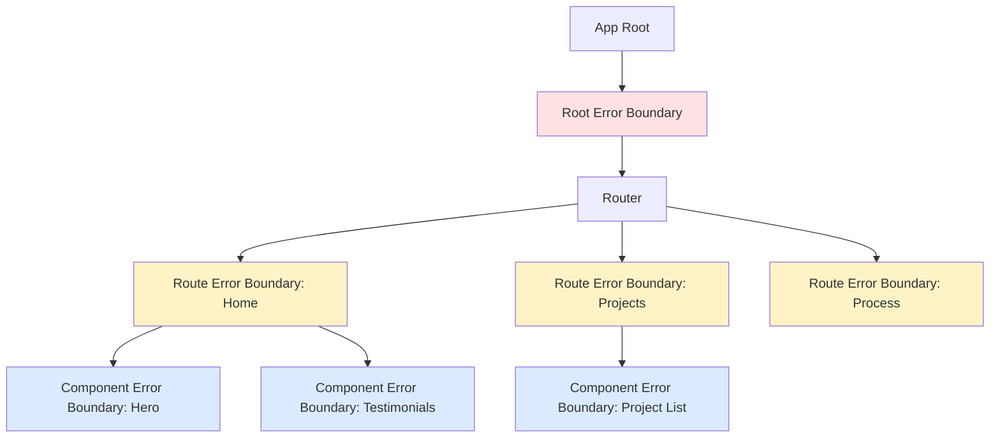

# Robust Frontend Error Boundaries Enhancement

## Overview

Enhance the existing error boundary implementation to provide robust error handling with granular boundaries, error recovery mechanisms, error reporting, and better user experience. The goal is to prevent entire app crashes and provide graceful degradation.

## Motivation

The current `file:client/src/components/ErrorBoundary/ErrorBoundary.tsx` is basic and lacks:
- **Reset functionality**: Users can't recover from errors without page refresh
- **Granular boundaries**: One error crashes the entire app
- **Error details**: No information for debugging
- **Error reporting**: No integration with error tracking services
- **Strategic placement**: Not used throughout the app tree

A robust error boundary system will improve app stability and user experience.

## Current State Analysis

**Existing Implementation:**
```typescript
// file:client/src/components/ErrorBoundary/ErrorBoundary.tsx
- Basic error catching
- Simple fallback UI
- Logs to console via logError()
- No reset mechanism
- No error details display
```

**Current App Structure:**
```typescript
// file:client/src/App.tsx
- No ErrorBoundary wrapping
- Providers: HelmetProvider > AuthProvider > ProjectsProvider > ScreenProvider
- Routes defined with react-router-dom
```

**Issues:**
1. ❌ ErrorBoundary not used in App.tsx
2. ❌ No granular boundaries for different sections
3. ❌ No way to recover from errors
4. ❌ No error details for debugging
5. ❌ No error reporting to external service

## Requirements

### Functional Requirements

1. **Multi-Level Error Boundaries**
   - Root-level boundary: Catches catastrophic errors
   - Route-level boundaries: Isolate page errors
   - Component-level boundaries: Protect critical sections

2. **Error Recovery**
   - Reset button to retry rendering
   - Automatic retry with exponential backoff (optional)
   - Preserve app state when possible

3. **Error Information**
   - Display error message (dev mode)
   - Show component stack trace (dev mode)
   - Hide sensitive info in production

4. **Error Reporting**
   - Log to console (dev)
   - Send to error tracking service (production)
   - Include context: user, route, timestamp, browser info

5. **Fallback UI**
   - User-friendly error messages (Hebrew)
   - Different fallbacks for different boundary levels
   - Navigation options to recover

### Non-Functional Requirements

1. **Performance**: Minimal overhead when no errors
2. **Accessibility**: Fallback UI must be accessible
3. **Developer Experience**: Easy to add boundaries
4. **Monitoring**: Integration-ready for Sentry/LogRocket

## Technical Approach

### Architecture



### Enhanced Error Boundary Features

#### 1. Reset Functionality

Add reset mechanism to ErrorBoundary:
- Reset button in fallback UI
- `resetErrorBoundary()` method
- Optional `onReset` callback prop
- Clear error state on route change

#### 2. Error Details Component

Create `ErrorDetails` component for dev mode:
- Display error message
- Show component stack
- Show error boundary name/location
- Copy error info button

#### 3. Fallback UI Variants

Create different fallback UIs:
- **Full page fallback**: For root boundary
- **Section fallback**: For route boundaries
- **Inline fallback**: For component boundaries

#### 4. Error Reporting Integration

Prepare for error tracking service:
- Abstract error reporting interface
- Environment-based reporting (dev vs prod)
- Include context metadata
- Rate limiting to prevent spam

### File Structure

```
client/src/
├── components/
│   ├── ErrorBoundary/
│   │   ├── index.tsx                    # Re-exports
│   │   ├── ErrorBoundary.tsx            # Enhanced boundary
│   │   ├── RootErrorBoundary.tsx        # Root-level variant
│   │   ├── RouteErrorBoundary.tsx       # Route-level variant
│   │   ├── ErrorFallback.tsx            # Fallback UI component
│   │   └── ErrorDetails.tsx             # Dev mode error details
│   └── ...
├── hooks/
│   └── useErrorBoundary.ts              # Hook for manual error throwing
└── utils/
    ├── errorHandler.ts                  # Enhanced with reporting
    └── errorReporting.ts                # Error reporting service
```

### Implementation Details

#### 1. Enhanced ErrorBoundary Component

Key improvements:
- Add `resetKeys` prop for automatic reset
- Add `onReset` callback
- Add `FallbackComponent` prop for custom UI
- Add error reporting in `componentDidCatch`
- Add boundary name for debugging

#### 2. Root Error Boundary

Wrap entire app in `file:client/src/App.tsx`:
- Catches catastrophic errors
- Full-page fallback with navigation
- Reports all errors to tracking service

#### 3. Route Error Boundaries

Wrap each route:
- Isolate page-level errors
- Section fallback with retry
- Allow navigation to other routes

#### 4. Component Error Boundaries

Wrap critical components:
- Protect expensive/risky components
- Inline fallback with minimal disruption
- Optional: hide component on error

#### 5. Error Reporting Service

Create abstraction for error tracking:
- Interface for reporting errors
- Mock implementation for dev
- Production implementation (Sentry/LogRocket)
- Include user context, route, browser info

### Error Boundary Placement Strategy

```typescript
// Root level - App.tsx
<RootErrorBoundary>
  <HelmetProvider>
    <AuthProvider>
      <ProjectsProvider>
        <ScreenProvider>
          <RouterProvider />
        </ScreenProvider>
      </ProjectsProvider>
    </AuthProvider>
  </HelmetProvider>
</RootErrorBoundary>

// Route level - Layout.tsx or individual routes
<RouteErrorBoundary name="Home">
  <Home />
</RouteErrorBoundary>

// Component level - Critical components
<ErrorBoundary name="Testimonials" inline>
  <TestimonialsSection />
</ErrorBoundary>
```

## UI Wireframes

### Root Error Boundary Fallback (Full Page)

```wireframe
<!DOCTYPE html>
<html dir="rtl">
<head>
<style>
  body {
    font-family: -apple-system, BlinkMacSystemFont, 'Segoe UI', sans-serif;
    margin: 0;
    padding: 0;
    direction: rtl;
    background: #f9fafb;
  }
  .error-page {
    min-height: 100vh;
    display: flex;
    align-items: center;
    justify-content: center;
    padding: 20px;
  }
  .error-container {
    max-width: 600px;
    background: white;
    border-radius: 12px;
    padding: 40px;
    box-shadow: 0 4px 6px rgba(0,0,0,0.1);
    text-align: center;
  }
  .error-icon {
    width: 80px;
    height: 80px;
    margin: 0 auto 24px;
    background: #fee2e2;
    border-radius: 50%;
    display: flex;
    align-items: center;
    justify-content: center;
    font-size: 40px;
    color: #ef4444;
  }
  .error-title {
    font-size: 24px;
    font-weight: 700;
    margin: 0 0 12px 0;
    color: #111827;
  }
  .error-message {
    font-size: 16px;
    color: #6b7280;
    margin: 0 0 32px 0;
    line-height: 1.6;
  }
  .error-actions {
    display: flex;
    gap: 12px;
    justify-content: center;
    flex-wrap: wrap;
  }
  .btn {
    padding: 12px 24px;
    border-radius: 8px;
    font-size: 14px;
    font-weight: 600;
    cursor: pointer;
    border: none;
    transition: all 0.2s;
  }
  .btn-primary {
    background: #3b82f6;
    color: white;
  }
  .btn-primary:hover {
    background: #2563eb;
  }
  .btn-secondary {
    background: #f3f4f6;
    color: #374151;
  }
  .btn-secondary:hover {
    background: #e5e7eb;
  }
  .error-details {
    margin-top: 32px;
    padding-top: 32px;
    border-top: 1px solid #e5e7eb;
    text-align: right;
  }
  .error-details-title {
    font-size: 14px;
    font-weight: 600;
    margin: 0 0 12px 0;
    color: #6b7280;
  }
  .error-details-content {
    background: #f9fafb;
    padding: 16px;
    border-radius: 8px;
    font-family: monospace;
    font-size: 12px;
    color: #374151;
    text-align: left;
    overflow-x: auto;
    max-height: 200px;
    overflow-y: auto;
  }
</style>
</head>
<body>
  <div class="error-page">
    <div class="error-container">
      <div class="error-icon">⚠</div>
      <h1 class="error-title">אופס! משהו השתבש</h1>
      <p class="error-message">
        אירעה שגיאה בלתי צפויה. אנחנו מצטערים על אי הנוחות.
        אנא נסה לרענן את הדף או לחזור לדף הבית.
      </p>
      <div class="error-actions">
        <button class="btn btn-primary" data-element-id="retry-button">
          נסה שוב
        </button>
        <button class="btn btn-secondary" data-element-id="home-button">
          חזור לדף הבית
        </button>
      </div>
      
      <!-- Dev mode only -->
      <div class="error-details">
        <div class="error-details-title">פרטי שגיאה (מצב פיתוח בלבד):</div>
        <div class="error-details-content">
          Error: Cannot read property 'map' of undefined<br>
          at ProjectList (ProjectList.tsx:45:12)<br>
          at Projects (Projects.tsx:23:5)<br>
          at RouteErrorBoundary (RouteErrorBoundary.tsx:18:3)
        </div>
      </div>
    </div>
  </div>
</body>
</html>
```

### Route Error Boundary Fallback (Section)

```wireframe
<!DOCTYPE html>
<html dir="rtl">
<head>
<style>
  body {
    font-family: -apple-system, BlinkMacSystemFont, 'Segoe UI', sans-serif;
    margin: 0;
    padding: 20px;
    direction: rtl;
    background: #f9fafb;
  }
  .page-layout {
    max-width: 1200px;
    margin: 0 auto;
  }
  .navbar {
    background: white;
    padding: 16px;
    border-radius: 8px;
    margin-bottom: 20px;
    box-shadow: 0 1px 3px rgba(0,0,0,0.1);
  }
  .error-section {
    background: white;
    border-radius: 12px;
    padding: 60px 40px;
    text-align: center;
    box-shadow: 0 1px 3px rgba(0,0,0,0.1);
  }
  .error-icon-small {
    width: 60px;
    height: 60px;
    margin: 0 auto 20px;
    background: #fef3c7;
    border-radius: 50%;
    display: flex;
    align-items: center;
    justify-content: center;
    font-size: 30px;
    color: #f59e0b;
  }
  .error-title-small {
    font-size: 20px;
    font-weight: 700;
    margin: 0 0 8px 0;
    color: #111827;
  }
  .error-message-small {
    font-size: 14px;
    color: #6b7280;
    margin: 0 0 24px 0;
  }
  .btn {
    padding: 10px 20px;
    border-radius: 8px;
    font-size: 14px;
    font-weight: 600;
    cursor: pointer;
    border: none;
    background: #3b82f6;
    color: white;
  }
  .btn:hover {
    background: #2563eb;
  }
</style>
</head>
<body>
  <div class="page-layout">
    <div class="navbar">
      <strong>ניווט האתר (עדיין עובד)</strong>
    </div>
    
    <div class="error-section">
      <div class="error-icon-small">⚠</div>
      <h2 class="error-title-small">לא ניתן לטעון את הדף</h2>
      <p class="error-message-small">
        אירעה שגיאה בטעינת התוכן. אנא נסה שוב.
      </p>
      <button class="btn" data-element-id="retry-section">
        טען מחדש
      </button>
    </div>
  </div>
</body>
</html>
```

### Component Error Boundary Fallback (Inline)

```wireframe
<!DOCTYPE html>
<html dir="rtl">
<head>
<style>
  body {
    font-family: -apple-system, BlinkMacSystemFont, 'Segoe UI', sans-serif;
    margin: 0;
    padding: 20px;
    direction: rtl;
    background: #f9fafb;
  }
  .page-content {
    max-width: 1200px;
    margin: 0 auto;
  }
  .section {
    background: white;
    padding: 40px;
    border-radius: 8px;
    margin-bottom: 20px;
  }
  .section-title {
    font-size: 24px;
    font-weight: 700;
    margin: 0 0 20px 0;
  }
  .error-inline {
    background: #fef3c7;
    border: 1px solid #fbbf24;
    border-radius: 8px;
    padding: 20px;
    text-align: center;
  }
  .error-inline-icon {
    font-size: 24px;
    margin-bottom: 8px;
  }
  .error-inline-text {
    font-size: 14px;
    color: #92400e;
    margin: 0 0 12px 0;
  }
  .btn-small {
    padding: 8px 16px;
    border-radius: 6px;
    font-size: 13px;
    font-weight: 600;
    cursor: pointer;
    border: none;
    background: #f59e0b;
    color: white;
  }
  .btn-small:hover {
    background: #d97706;
  }
</style>
</head>
<body>
  <div class="page-content">
    <div class="section">
      <h2 class="section-title">דף הבית</h2>
      <p>תוכן רגיל שעובד...</p>
    </div>
    
    <div class="section">
      <h2 class="section-title">המלצות לקוחות</h2>
      <div class="error-inline">
        <div class="error-inline-icon">⚠</div>
        <p class="error-inline-text">לא ניתן לטעון את ההמלצות</p>
        <button class="btn-small" data-element-id="retry-component">
          נסה שוב
        </button>
      </div>
    </div>
    
    <div class="section">
      <h2 class="section-title">פרויקטים אחרונים</h2>
      <p>תוכן רגיל שעובד...</p>
    </div>
  </div>
</body>
</html>
```

## Implementation Examples

### Example 1: Enhanced ErrorBoundary with Reset

```typescript
interface ErrorBoundaryProps {
  children: ReactNode;
  fallback?: ReactNode;
  onReset?: () => void;
  resetKeys?: unknown[];
  name?: string;
  inline?: boolean;
}

export class ErrorBoundary extends Component<ErrorBoundaryProps, State> {
  // Reset error when resetKeys change
  componentDidUpdate(prevProps: ErrorBoundaryProps) {
    if (this.state.hasError && this.props.resetKeys) {
      if (!arraysEqual(prevProps.resetKeys, this.props.resetKeys)) {
        this.reset();
      }
    }
  }

  reset = () => {
    this.props.onReset?.();
    this.setState({ hasError: false, error: null });
  };

  // ... rest of implementation
}
```

### Example 2: useErrorBoundary Hook

```typescript
// For manually triggering error boundaries
export function useErrorBoundary() {
  const [error, setError] = useState<Error | null>(null);
  
  if (error) {
    throw error;
  }
  
  return {
    showBoundary: (error: Error) => setError(error),
    resetBoundary: () => setError(null),
  };
}
```

### Example 3: Error Reporting Service

```typescript
// utils/errorReporting.ts
interface ErrorContext {
  user?: { id: string; email: string };
  route?: string;
  componentStack?: string;
  [key: string]: unknown;
}

export const errorReporting = {
  captureException(error: Error, context?: ErrorContext) {
    if (import.meta.env.PROD) {
      // Send to Sentry/LogRocket
      // Sentry.captureException(error, { contexts: context });
    } else {
      console.error('[Error Reporting]', error, context);
    }
  },
};
```

## Testing Strategy

1. **Unit Tests**
   - Test error boundary catching errors
   - Test reset functionality
   - Test fallback rendering

2. **Integration Tests**
   - Test error propagation through boundary hierarchy
   - Test error reporting integration
   - Test route change resets

3. **Manual Testing**
   - Trigger errors in different components
   - Verify appropriate fallback UI
   - Test recovery mechanisms

## Migration Strategy

1. **Phase 1**: Enhance ErrorBoundary component
2. **Phase 2**: Add RootErrorBoundary to App.tsx
3. **Phase 3**: Add RouteErrorBoundary to each route
4. **Phase 4**: Add component boundaries to critical sections
5. **Phase 5**: Integrate error reporting service

## Dependencies

- No new dependencies required
- Optional: Sentry SDK for production error tracking
- Uses existing error handling utilities

## Success Metrics

- ✅ Root error boundary wrapping app
- ✅ Route error boundaries on all major routes
- ✅ Component boundaries on 3+ critical components
- ✅ Reset functionality working
- ✅ Error reporting integrated (dev mode)
- ✅ Fallback UIs tested and accessible
- ✅ No full app crashes from component errors