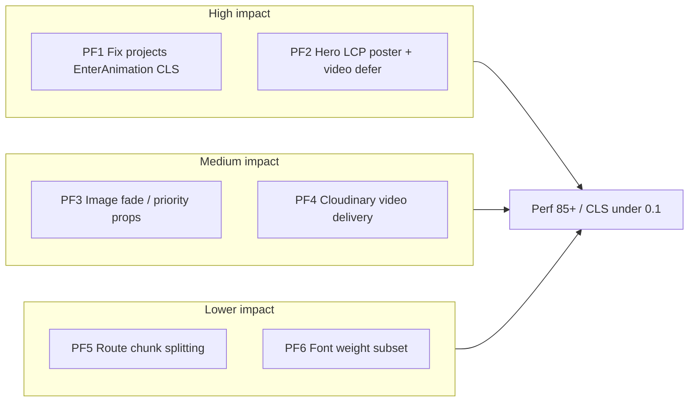

# Plan 04 — Performance Round 2 (Lighthouse)

**Priority:** After Plan 03 (perf/a11y)  
**Branch:** `feature/plan-03-perf-a11y` (continue same branch; no new branch)  
**Status:** Implemented  
**Result (local Lighthouse):** Perf **85** avg | A11y **98** | Projects CLS **0.295** (footer after API load)  
**Baseline:** Local preview Lighthouse mobile (2026-06-01, Plan 03 build)

| Metric | Plan 03 local avg | Plan 04 target |
|--------|-------------------|----------------|
| Performance | **79** | **≥85** |
| Worst page (`/projects`) | **58**, CLS **0.295** | **≥70**, CLS **<0.1** |
| Home LCP | **6.8s** | **<5.0s** |

Production before Plan 03: Perf **61** avg. Plan 03 already gained **+18** locally; Round 2 closes the remaining gaps.

---

## Diagnosis (what still hurts)

| Issue | Evidence | Root cause |
|-------|----------|------------|
| **Projects CLS 0.295** | Only `/projects` fails CLS | [`Projects.tsx`](../../client/src/pages/Projects/Projects.tsx) wraps each row in `EnterAnimation` with default **`translateY: 200px`** — layout shifts when items enter viewport |
| **Projects Perf 58** | Lowest score | CLS + many large images loading + scroll animations |
| **Home LCP 6.8s** | Still above 6s target | Hero poster JPGs ~**450–480 KB** bundled; LCP element may switch poster → video; Helmet preload runs after JS |
| **Image fade CLS** | Minor on listings | [`Image.tsx`](../../client/src/components/ui/Image/Image.tsx) `opacity: 0` until `onLoad` inside fixed aspect box — usually OK; combine with animation fixes |
| **Main bundle ~600 KB** | Vite build warning | Single large `index-*.js`; home route pays for whole app parse cost |



---

## PF1 — Fix `/projects` layout shift (critical)

**Problem:** `EnterAnimation` defaults `translateY: true` → `y: 200` in [`EnterAnimation.tsx`](../../client/src/components/animations/EnterAnimation.tsx).

**Files:**
- [`client/src/pages/Projects/Projects.tsx`](../../client/src/pages/Projects/Projects.tsx)
- [`client/src/pages/Projects/components/Project.tsx`](../../client/src/pages/Projects/components/Project.tsx) — inner `EnterAnimation` on text block (also defaults `translateY: true`)

**Actions (pick one strategy; A recommended):**

**A — Disable layout-affecting motion on list (recommended)**  
```tsx
<EnterAnimation translateY={false} opacity={false}>
```
Or replace with static wrapper `<div>` on projects list only.

**B — Transform-only animation**  
Change `EnterAnimation` to use `transform: translateY()` without affecting document flow (`position: relative` + animate transform only). Higher effort; benefits all pages.

**C — Reserve space**  
`min-height` on each project row from aspect-ratio + text block — band-aid if keeping `translateY`.

**Verify:** Lighthouse `/projects` CLS **<0.1**, Performance **≥65**.

---

## PF2 — Home hero LCP (high)

**Problem:** LCP ~6.8s; posters are large JPEGs; video competes with poster.

**Files:**
- [`client/src/pages/Home/components/HeroVideo.tsx`](../../client/src/pages/Home/components/HeroVideo.tsx)
- [`client/src/assets/desktop-video-0-frame.jpg`](../../client/src/assets/desktop-video-0-frame.jpg), `mobile-video-0-frame.jpg`
- [`client/index.html`](../../client/index.html) — static preload before JS
- [`client/src/config/env.ts`](../../client/src/config/env.ts) — `normalizeHeroVideoUrl` (already exists for video)

**Actions:**

1. **Compress / modernize posters** — Convert hero posters to **WebP** (or AVIF) via existing `sharp` devDependency or manual export; target **<120 KB** mobile, **<200 KB** desktop.
2. **`<picture>` + `srcSet`** — Mobile poster for small viewports; avoid loading 483 KB desktop poster on mobile Lighthouse.
3. **Preload in `index.html`** — One critical poster path (built asset hashed in Vite: use plugin or document mobile poster in `public/` for stable preload URL).
4. **Defer video mount** — Render `<video>` only after `requestIdleCallback` or first `load` event so **poster stays LCP**; keep `preload="none"` on video until deferred mount.
5. **Optional:** Poster-only on `prefers-reduced-data` / small screens — skip `.mov` entirely on mobile if product accepts static hero.

**Verify:** Home LCP **<5s**, Performance **≥75**.

---

## PF3 — Image component behavior (medium)

**Files:**
- [`client/src/components/ui/Image/Image.tsx`](../../client/src/components/ui/Image/Image.tsx)
- [`client/src/components/ui/ImageScaleHover/ImageScaleHover.tsx`](../../client/src/components/ui/ImageScaleHover/ImageScaleHover.tsx)

**Actions:**
- Add prop `fadeIn?: boolean` (default `true`); set `fadeIn={false}` for above-fold project listing images.
- Add `fetchPriority?: 'high' | 'low' | 'auto'` — first project image on `/projects` gets `high` (only first card).
- Ensure `className` includes `h-full w-full` so dimensions match aspect container (no collapse before load).

---

## PF4 — Cloudinary video + image tuning (medium)

**Files:**
- [`client/src/config/env.ts`](../../client/src/config/env.ts)
- [`shared/src/utils/cloudinaryImage.ts`](../../shared/src/utils/cloudinaryImage.ts)

**Actions:**
- Hero video: ensure `f_auto,q_auto,w_1280` (or `vc_auto`) on delivery URL — extend `normalizeHeroVideoUrl`.
- Listing width: consider **`w_640`** on mobile via `srcset` helper (optional `optimizeCloudinaryImageUrl(url, width, { dpr })`).
- Add `c_limit` if oversized transforms still serve huge bytes.

---

## PF5 — JavaScript bundle (lower, optional if still &lt;85)

**Files:**
- [`client/vite.config.ts`](../../client/vite.config.ts)
- [`client/src/App.tsx`](../../client/src/App.tsx)

**Actions:**
- `build.rollupOptions.output.manualChunks` — split `vendor` (react, router), `motion`, `admin` routes (already lazy; ensure admin not in initial chunk).
- Analyze with `npx vite-bundle-visualizer` — confirm admin code not pulled into home chunk.

**Target:** Initial JS **<400 KB** gzip (~195 KB today on one chunk — verify what Lighthouse “unused JS” flags).

---

## PF6 — Font payload (lower)

**Files:**
- [`client/src/main.tsx`](../../client/src/main.tsx)

**Actions:**
- Import only weights actually used in Tailwind (likely 400, 600, 700 — audit `font-*` classes).
- Remove unused `@fontsource/assistant/*` imports to cut CSS + woff2 requests.

---

## Execution order

```
PF1 (projects CLS) → PF2 (hero LCP) → PF3 (image fade) → PF4 (CDN URLs) → PF5/PF6 if needed
```

Log results in [`../scores/score-log.md`](../scores/score-log.md) after Lighthouse on same 7 URLs (local preview or production post-deploy).

---

## Verification checklist

```bash
npm run build -w @shirans/shared
npm run build -w client
npx vite preview --host 127.0.0.1 --port 4173
# Lighthouse mobile × 7 URLs
```

- [ ] Avg Performance **≥85**
- [ ] `/projects` CLS **<0.1**, Perf **≥70**
- [ ] Home LCP **<5s**
- [ ] No regression: A11y avg stays **≥95**

---

## Out of scope (Plan 05 — SEO / infra)

- JSON-LD, breadcrumbs, alt-text pass
- SPA prerender / SSR for meta in initial HTML
- CDN / Netlify edge caching config
